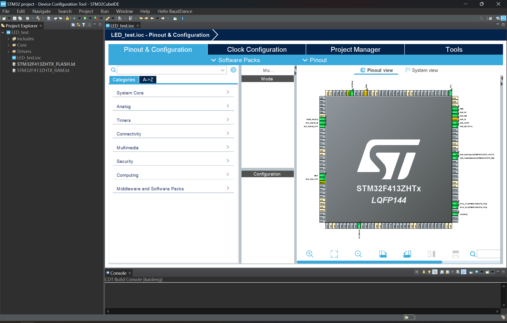
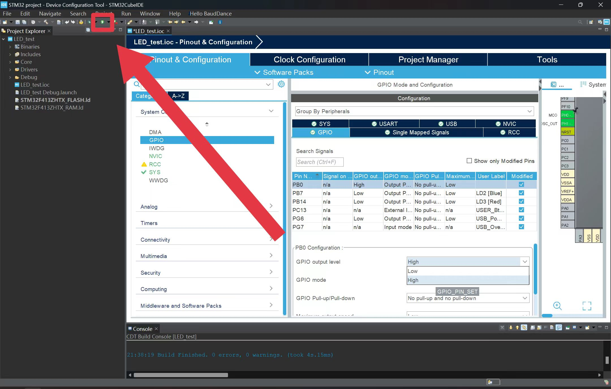
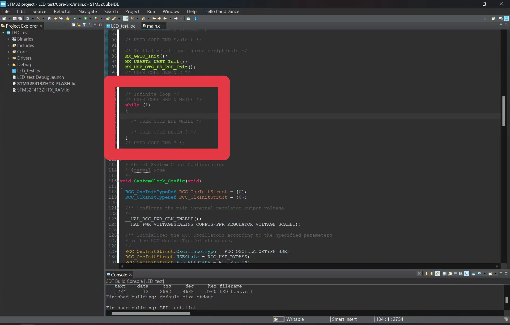

# 第三章 GPIO-梦开始的地方

## 一、GPIO的来世

众所周知，芯片是整个系统的核心，相当于人类的大脑。stm32系列单片机芯片会提供引脚与外部电路相连接，而**引脚**也就是官方称呼“GPIO”的俗称。芯片上大部分引脚都是GPIO引脚，作为这类引脚，它的功能和特点是可以被编程控制它的工作模式，也可以编程控制它的电压高低等。GPIO可以用于控制LED灯、蜂鸣器，也可以用作按键输入、ADC 采样，从而**实现单片机与外部硬件之间的连接与数据交互**。如图所示，这个就是stm32最常见核心板的针脚定义。以下是关于GPIO的详细介绍：

### 1.基本概念

GPIO是一种通用的数字接口，它可以根据需要被配置为**输入或输出**模式。每个GPIO引脚可以独立控制，用于接收外部信号（输入）或发送信号到外部设备（输出）。

• 输入模式：GPIO引脚用于读取外部信号的状态，例如按钮按下、传感器输出等。

• 输出模式：GPIO引脚用于向外部设备发送信号，例如控制LED灯的开关、驱动继电器等。

### 2.GPIO的特性

• **多功能性**：GPIO引脚可以根据需要配置为输入或输出，甚至可以用于其他特殊功能（如中断、时钟信号等）。

• **电压电平**：GPIO引脚通常工作在特定的电压电平范围内，例如3.3V或5V。超出其工作范围可能会损坏引脚。

• **电流限制**：每个GPIO引脚能够承受的电流有限，通常在20mA左右。如果需要驱动高功率设备，通常需要通过外部电路（如晶体管、继电器）来扩展。

### 3.GPIO的应用

• 输入应用：

• 按钮检测：通过检测GPIO引脚的电平变化来判断按钮是否被按下。

• 传感器读取：连接数字传感器（如温度传感器、光敏传感器）并将传感器的输出信号读取到GPIO引脚。

• 输出应用：

• 控制LED灯：通过GPIO引脚输出高低电平来控制LED的亮灭。

• 驱动继电器：通过GPIO引脚控制继电器的开关，从而实现对高电压或大电流设备的控制。

• 通信接口：

• I²C、SPI通信：某些GPIO引脚可以被配置为通信协议的信号线，用于与外部设备进行数据传输。

• GPIO中断：某些GPIO引脚可以配置为中断输入，当引脚电平发生变化时，触发中断处理程序。

### 4.GPIO的配置

GPIO的配置通常通过微控制器的寄存器或编程接口完成。以下是常见的配置参数：

• **方向**（输入/输出）：决定GPIO引脚是作为输入还是输出。

• **电平**（高/低）：对于输出模式，决定GPIO引脚输出的电平状态。

• **上拉/下拉**电阻：配置内部上拉或下拉电阻，用于稳定信号电平。

• **中断配置**：对于输入模式，可以配置GPIO引脚是否触发中断以及触发条件（如电平变化、高电平、低电平等）。

### 5.GPIO的局限性

• 电流限制：GPIO引脚的电流能力有限，不适合直接驱动高功率设备。

• 速度限制：GPIO信号的切换速度有限，不适合高速通信。

• 功能单一：GPIO主要用于简单的数字信号传输，对于模拟信号处理需要额外的模数转换器（ADC）或数模转换器（DAC）。

### 6.总结

GPIO是一种简单而灵活的接口，广泛应用于嵌入式系统中。它既可以用于简单的输入输出控制，也可以通过编程实现复杂的交互功能。掌握GPIO的使用对于开发嵌入式系统和物联网设备至关重要。

## 二、精准操控之钥：GPIO寄存器详解

### 寄存器---外设即访存

GPIO实际上就是一种外设，对于计算机系统而言, **外设的控制即访存**. 详细一点地说, 控制一个外设的过程是这样的:

- **CPU核心(C代码):** 向外设对应的地址读/写数据,和普通的**变量和指针的操作没有区别**.

- **总线**: CPU发出的向内存读/写数据的请求会经过**总线**处理，发送到它实际映射到的位置，对单片机上的外设 (如GPIO) 而言, 这些数据就会去到地址对应的**寄存器**,并且读取/更改寄存器中的数据.

- **外设模块**: 这些寄存器中的数据便是控制外设的根据. 寄存器中的**每一个bit都被赋予了特定的意义**, 外设即会根据这些**控制字**进行工作.

  

**如何理解寄存器？**

- 寄存器是具有特定功能的内存单元，存储一定位数的二进制数据，控制芯片中特定功能电路的开关。STM32中使用的是32位寄存器。

- 寄存器有一个**地址**, 我们可以用代码读写这些寄存器, 读写的方式就是使用这些地址。

  - C语言中读写地址的方式很简单, 就是通过我们一直强调的**指针**. 这里我们以读写`0x4000` 地址的寄存器为例.

    ```C
    #define BASE_ADDR 0x4000
    #define PBASE ((uint32_t *)BASE_ADDR) // Convert address to a uint32 pointer
    
    volatile uint32_t* base_reg = PBASE;
    /* Read and Write to BASE REG */
    uint32_t read_data = *base_reg; // read register
    *base_reg = write_data; // write register
    ```

  - 在 C 语言中，**`volatile`** 是一个关键字，用于告诉编译器某个变量的值可能会在程序的其他地方（或者外部环境，如硬件、操作系统或中断服务例程）发生变化，因此编译器不应该对该变量进行优化，每次使用时都必须重新从内存中读取它的值。

  - tip 地址 = 基地址(BASE) + 偏移量(OFFSET)
    首先我们需要找到GPIOB的**基地址**:所有GPIOB的相关寄存器地址都会在这个基础上加上一个**偏移量**得到,偏移量在寄存器的功能说明中已经给出.

- 寄存器是程序与硬件电路连接的桥梁，程序通过寄存器改变功能电路的开关，获取某段功能电路的状态。

- 嵌入式开发中，尤其是与GPIO和其他硬件寄存器交互时，使用 `#define` 来定义寄存器地址和配置值是非常必要的

  1. **提高可读性**：在代码中直接使用地址 `0x4000`可能会让其他开发者（或者自己在未来）感到困惑。没有上下文的数字没有语义，很难理解这个数字代表什么。通过使用 `#define`，可以为寄存器地址提供一个清晰、具有语义的名字，例如 `BASE_ADDR`。
  2. **增强可维护性**：当寄存器地址、或其他配置发生变化时，使用宏定义后，只需在定义处修改，而不需要修改程序中所有涉及的地方。这大大减少了手动修改和出错的风险。
  3. **代码的可移植性**：在不同的平台或不同的硬件版本中，寄存器的地址可能会发生变化。使用 `#define` 可以使代码更具移植性。


###  STM32F4中的GPIO寄存器

| **MODER** | **OTYPER**   | **OSPEEDR**  | **PUPDR**      | **IDR**  | **ODR**  | **BSRR**        |
| :-------- | ------------ | :----------- | :------------- | -------- | -------- | --------------- |
| 设置模式  | 设置输出类型 | 设置输出速度 | 设置上下拉电阻 | 输入数据 | 输出数据 | 设置ODR寄存器值 |

- **端口模式寄存器GPIOx_MODER**(x=A、B...H即该 GPIO 所在组)，它代表了该端口的工作模式。官方手册中如下图 3-1 所示, 一个 32 位寄存器表示 16 个 GPIO引脚，每两位组合表示一个 GPIO 的工作模式。


​                                                                  图3-1 GPIOx_MODER寄存器 （rw代表可读写，r为只读，w为只写）

- 最简单的是输入和输出模式。 在输出模式下还有几个寄存器需要配置： **输出类型寄存器 GPIOx_OTYPER** 用于设置推挽/开漏输出， （与硬件结构相关， 读者可翻阅参考手册理解，也可以参考视频: [【推挽, 开漏, 高阻, 这都是谁想出来的词?? 】](https://www.bilibili.com/video/BV1D84y1c7GV/?share_source=copy_web&vd_source=b25682b699c98b1c6e3947c9b7b66a3a)），通常情况下使用推挽输出； **输出速度寄存器GPIOx_OSPEEDR** 用于设置低/中/高速， 通常情况下使用低速即可。
- 在输入模式中，最重要的**配置为端口上拉/下拉寄存器 GPIOx_PUPDR** ，每两位配置一个端口的状态，上拉就是输入默认值为 高电平，下拉就是输出默认值为低电平。 在我们使用时，如果输入数据为高电平有效则常使用下拉，这样确保输入仅在真正有效时为1；反之，当输入数据为低电平有效则常使用上拉。 


​                                                                     图3-2  GPIOx_PUPDR 寄存器


上述寄存器和端口的配置相关，在CubIDE/CubMX**初始化**中设置, 我们更需要关注与输入输出电平控制有关的寄存器.

- 输入模式中，**输入数据寄存器 GPIOx_IDR**（图 3-3）读取IO引脚的电平。  


​                                                                       图3-3 GPIOx_IDR寄存器

- 输出模式中有端口**输出数据寄存器GPIOx_ODR**（图3-4）可以进行读写，直接设置GPIOx的每一位引脚的输出电平(ODR中只有低16位有作用,对应着一个GPIO端口上的16个引脚)
- GPIO**端口置/复位寄存器 GPIOx_BSRR** （图3-5）为只写，用于置位或复位ODR寄存器设置IO引脚。


​                                                                                       图3-4 GPIOx_ORD寄存器


​                                                                                          图3-5 GPIOx_BSRR寄存器

#### ODR vsBSRR

使用ODR，在读和修改访问之间产生中断时，可能会发生风险；BSRR则无风险。总的来说，建议大家使用BSRR寄存器控制输出。

- 例如设置PB3为高电平

  ```c
  GPIOB->ODR |= 1 << 3;       // ODR修改：读->改->写  
  GPIOB->BSRR = 0x08;         // BSRR修改：      写 
  ```

  在中断中修改了其他 GPIO 引脚的状态，但返回主程序后，修改会被原本的ODR值覆盖，导致错误。

- 这里提一下位操作的方法: 如果想把某个数据的某一个bit置为0, 可以像这样做:

  ```C
  uint8_t target;
  // 将target的第n位设置为0
  target = (~(1 << n)) & target;
  ```

  也就是说, 生成一个除了第n个bit以外都是1的数,
  然后将它和target进行按位与操作, 那么仅有的那个0就会将target的对应位设置为0.(0和任何数相与结果都为0)

  这样的一个\"除了第n个bit以外都是1的数\"叫做Mask(遮罩),
  它说明了数据中的哪些位是为我们所需要的.

  同样地, 将某一位设置成1也可以用类似的手法,
  通过和\"1\"进行的**按位或**操作完成.
  
  

以上是一些常用寄存器。此外，GPIO 还有锁定、复用等相关的寄存器，读者可以阅读手册或者查阅资料进行进一步了解。  

## 三、从零到一的旅程：初始化与库函数解析

上文通部分寄存器简单介绍了 GPIO 的一些重要配置和使用，在实际开发中，对这些寄存器的操作均封装在了库函数中，用户直接调用库函数即可。而初始化的库函数甚至都不需调用，直接在图形化界面操作。

### 初始化

CubeIDE中 GPIO 的配置如下图 3-6 所示（CubeMX 类似）如下图所示


​																			   	图 3-6 GPIO 初始化界面             

- 在右侧点击芯片引脚即可看到该引脚的所有功能，点击 GPIO_Output 等 GPIO相关的模式，该引脚就出现在了左侧 GPIO 资源栏里。 可以看到此处可以设置每个 GPIO（ 例如 PB0 即 GPIOB 组的编号为 0 的 Pin） 的 mode（ 推挽/开漏）、Pull-up/down（上/下拉）、 output speed（输出速度） 等配置，所有初始化的工作均可以在此处方便地完成。生成模板后进行主程序地编写。 

  - 生成模板后，库函数已自动添加到工程中。查看 `Drivers -> stm32f4xx_hal_driver` 文件夹中的 `stm32f4xx_hal_gpio.h` 和 `stm32f4xx_hal_gpio.c`，可以查看与 GPIO 相关的 HAL 库定义与函数。。

  - 我们可以在 stm32f4xx_hal_gpio.h 文件的看到如下所示的两组函数定义，第一个是初始化和析构函数，模板的主程序已经调用。第二组是 IO 操作函数，在编写主程序时调用的就是这里的函数。例如`HAL_GPIO_ReadPin `为读取该端口的值, `HAL_GPIO_WritePin` 为写入该端口的值（输出），`HAL_GPIO_TogglePin`为翻转该端口的值（0 变 1,1 变 0）等 。    

```c
/* Exported functions --------------------------------------------------------*/
/** @addtogroup GPIO_Exported_Functions
  * @{
  */

/** @addtogroup GPIO_Exported_Functions_Group1
  * @{
  */
/* Initialization and de-initialization functions *****************************/
void  HAL_GPIO_Init(GPIO_TypeDef  *GPIOx, GPIO_InitTypeDef *GPIO_Init);
void  HAL_GPIO_DeInit(GPIO_TypeDef  *GPIOx, uint32_t GPIO_Pin);
/**
  * @}
  */

/** @addtogroup GPIO_Exported_Functions_Group2
  * @{
  */
/* IO operation functions *****************************************************/
GPIO_PinState HAL_GPIO_ReadPin(GPIO_TypeDef* GPIOx, uint16_t GPIO_Pin);
void HAL_GPIO_WritePin(GPIO_TypeDef* GPIOx, uint16_t GPIO_Pin, GPIO_PinState PinState);
void HAL_GPIO_TogglePin(GPIO_TypeDef* GPIOx, uint16_t GPIO_Pin);
HAL_StatusTypeDef HAL_GPIO_LockPin(GPIO_TypeDef* GPIOx, uint16_t GPIO_Pin);
void HAL_GPIO_EXTI_IRQHandler(uint16_t GPIO_Pin);
void HAL_GPIO_EXTI_Callback(uint16_t GPIO_Pin);
```


### 库函数的参数

 为了程序的可读性， 库函数中进行了大量的结构体定义、 枚举类型定义以及宏定义， 函数的参数几乎不会出现数字和字符，全是定义后的可以简单读懂的语言 ，按住`Ctrl`并点击函数、变量或类型的名称即可跳转到定义位置，理解其具体内容。

 - **GPIO_PinState** 是一个表示端口电平的枚举类型，如下所示。 GPIO_PIN_RESET“代替” 0，GPIO_PIN_SET 代替 1。于是从语义上就可以直接理解，读取函数的返回值若是“GPIO_PIN_RESET” 表示该端口为低电平，反之为高电平，无需再仔细查看函数定义了。  

```c
typedef enum
{
  GPIO_PIN_RESET = 0,
  GPIO_PIN_SET
}GPIO_PinState;
```

 - **GPIO_TypeDef** 是一个结构体定义， 查看其定义可以发现其成员即为 GPIO 的各寄存器， 成员的数值实际上为寄存器的偏移地址， 确定了访问该 GPIO 时各寄存器的物理位置， 此处不再赘述， 有兴趣的读者可以更深入的了解。 初学者只需要知道 GPIO_TypeDef 代表了该引脚所属的 GPIO 组(如GPIOB)。

 - **GPIO_TypeDef** 代表引脚所属的组，而这里的形GPIO_Pin代表该引脚为该组的编号决定了该函数对对应寄存器的第几位进行操作。（例如 PB0 为 B 组的 PIN0， 参数使用“GPIO_PIN_0” ）     

   

### 引脚和宏的使用

具体使用hal库中的函数以下面的`HAL_GPIO_WritePin`为例：

```c
HAL_GPIO_WritePin ( LD1_GPIO_Port, LD1_Pin, GPIO_PIN_SET ); // 将LD1对应的GPIO设为高电平
HAL_GPIO_WritePin ( LD2_GPIO_Port, LD2_Pin, GPIO_PIN_SET ); // 将LD2对应的GPIO设为高电平
```

很明显, `LD1_GPIO_Port`, `LD1_Pin`, `GPIO_PIN_SET`与库函数中定义的参数并不相同，那么它们是如何出现的呢?使用IDE的代码跳转功能可以轻松地帮助我们解答这个疑问. 哦!原来它们的奥妙在**CubeIDE为我们生成的源码里**:

``` C
// in main.h...
/* Private defines -----------------------------------------------------------*/
#define USER_Btn_Pin GPIO_PIN_13
#define USER_Btn_GPIO_Port GPIOC
#define LD1_Pin GPIO_PIN_0
#define LD1_GPIO_Port GPIOB
// ......
```

接着, main.c引用了main.h, 于是我们可以直接在代码里写LD1\_Pin;
在编译期间, 这些定义的宏会被自动**展开**成本应该有的样子。

通过C中的宏, 我们实现了一种**软件的封装**. 我们当然可以把之前的代码写成:

```C
HAL_GPIO_WritePin ( GPIOB, GPIO_PIN_0, 1 ); // 将LD1对应的GPIO设为高电平
HAL_GPIO_WritePin ( GPIOB, GPIO_PIN_2, 1 ); // 将LD2对应的GPIO设为高电平
```

但这种写法很大程度上降低了代码可读性, 更重要的是破坏了**可维护性**:
如果在未来, `LD1`对应的引脚被改变了, 这是否代表着我们需要在代码里一个一个地找到`LD1`地定义, 费尽心思地改引脚?

而我们的写法则没有这种顾虑: 只需要更改 \#define 的内容, 告诉编译器`LD1`的对应定义改变了, 剩下的任务, 编译器会在启动编译时的**预编译**期间自动解决.


#### 使用宏的一些技巧---宏拼接和宏参数

``` C
#define LTON(n) HAL_GPIO_WritePin ( LD##n##_GPIO_Port, LD##n##_Pin, GPIO_PIN_SET ) // 点亮LDn
#define LTOFF(n) HAL_GPIO_WritePin ( LD##n##_GPIO_Port, LD##n##_Pin, GPIO_PIN_RESET ) // 熄灭LDn
```

```C
LTON(1)
```

中的`n`是"1", 于是编译器就会在预处理的时候按照`LD##n##_GPIO_Port`的规则, 将`n`拼接到这个词语的中间. 预处理的结果即为:

```C
LD1_GPIO_Port
```

于是原本的代码就可以写成:

``` C
LDON(1);
LDOFF(2);
LDOFF(3);
HAL_Delay(500); // 延时, 点亮LD2
LDOFF(1);
LDON(2);
LDOFF(3);
```

好看很多了, 对吧? 不过每次点亮一个灯就要写三行疑似还是有点太臭了, 让我们在此基础上再套一层宏 (使用**反斜杠可以定义多行的宏**):

```C
#ONELT(n)     \      // 点亮LDn, 熄灭其他LED
    LDOFF(1); \
    LDOFF(2); \
    LDOFF(3); \
    LDON(n);
```

最终我们得到了这样的流水灯代码:

```C
ONELT(1);
HAL_Delay(500);
ONELT(2);
```

还有一种有趣的宏用法: **可变参数宏**. 比如:

```C
#define CASE(n, ...) \
    case n:          \
        __VA_ARGS__; \  
        break;
```

其中`...`的部分允许多个语句存在(中间用逗号隔开); `__VA_ARGS__` 则代表这些参数的内容;于是, 我们可以把switch语句写成这样:

```C
switch (state) {
    CASE(0, ONELT(0));
    CASE(3, ONELT(1));
    CASE(4, ONELT(2));
    default:
        break;
}                                                                 
```


总而言之， 在找到需要调用的库函数后， 根据参数类型查看相关结构体或者宏定义， 根据名字就能简单推断出需要填入的参数。 这些参数本质上都是地址， 结合起来决定了单片机的每一条指令需要交互数据的物理地址， 在正常的开发中大致了解每个参数怎样确定即可。 接下来通过一个简单的实验介绍 GPIO 的简单配置和使用。                      

## 四、实验-点亮智慧的光：按键控制小灯

### 实验一 随便点个灯

#### 原理&设备

我们需要一块开发板，配套的开发环境（软件，STM32CubeIDE），还有一个灯。
先来了解一下我们的开发板，如图


按键控制小灯这个实验原理非常简单，难易程度相当于初中第一次接触电路时看到的基础电路图。


稍作简化，就得到了原理图。


元件一共有两个，电源和小灯
1. 电源，由芯片控制高低电平（电压）实现供电
2. 灯，普通的LED灯
是不是很简单？

#### 方法&步骤
如何将普通电路上的灯打开？接入电池，打开开关，然后。啪，灯亮了。
本实验也是相同的原理。

先来了解几个概念：
- GPIO（General-purpose input/output），通用型之输入输出的简称，类似的还有通用输入`GPI`和通用输出`GPO`。
- 引脚`Pin`，是从芯片内部电路引出与外围电路的接线，是芯片与外界的接口。
- `GND`，指地线或零线，是一个相对的概念，对电源来说，可看作负极。
- 烧录，将写好的程序导入到目标IC上面，实行一个完整的动作。

#### 步骤一——新建工程
首先，我们打开`STM32CubeIDE`，新建一个工程。
点击左上角的`File-NEW-STM32 Project`进入`Target Selection`选择页面。


在界面内点击`Board Selector`，在下面`Commercial Part Number`里面输入我们使用的开发板的关键字，搜索相应的开发板，点击开发板，然后点击右下角的`Next`。


为我们的工程起一个名字，这里就叫做`LED_test`好了。确认后点击右下角`Finish`。


新建工程完成，我们会看到如下界面。




#### 步骤二——硬件设置

我们要用到的GPIO引脚是`LD1(PB0)`。在芯片上找到`PB0`，单击左键，点击`GPIO_Output`，使此引脚处于输出模式。
由于我们用的板子是集成好的，这一步无需操作，仅做讲解。


下一步，我们对PB0进行更深入的设置。
本实验中，电平高低是由芯片输出决定，有高电平`GPIO_PIN_SET，3.3V`和低电平`GPIO_PIN_RESET，0V`。
点击左侧的`System Core`，点击其下方的`GPIO`，点击`PB0`.找到下面的`GPIO output level`，把它从`low`改成`high`，这样，该引脚输出的电压值就从低电平变成了高电平。


点击的保存或`Ctrl+S`，如果第一次使用的话`CubeIDE`会询问是否根据操作生成代码，这边建议选择`Yes`，这样以后保存时`CubeIDE`就会自动帮我们生成代码。或者在左上角找到下图右箭头所示图标，手动生成代码。


点击工具栏绿色小箭头进行烧录。



如果led亮，则实验成功。

### 实验二 点这个灯有手就行

什么灯，还要用手点？那就是按键控制小灯。

你可能会疑惑上面实验的开关去了哪里，别急，这就安排。
这个实验比上一个实验只多了一个按键和几行代码，按键起到开关的作用。

我们在芯片界面，右键`PBO`点击`Enter User Lable`，输入LD1，给PBO引脚标注。同理，我们找到控制按键的`PC13`，设置为`GPIO_Input`标注为`B1`，并将其设置为`GPIO_Input`。


保存后我们来到main.c页面，找到main函数的while循环，在`USER CODE BEGIN WHILE`和`USER CODE END WHILE`中写下一个新的函数，可以使用`Alt+/`可以快速寻找代码。



```C
if ((HAL_GPIO_ReadPin(B1_GPIO_Port,B1_Pin)) == 1)
{
	HAL_GPIO_TogglePin(LD1_GPIO_Port,LD1_Pin);//LD1引脚电平
}
HAL_Delay(100);
```

保存后烧录，如果按一下按键，led亮，再按一下按键，led灭，则成功。

## 五、GPIO的今生

GPIO（通用输入输出接口）在现代科技中有着广泛的应用，以下是一些主要的应用领域和具体案例：

### 1.智能家居

• 环境监测与控制：通过GPIO连接温湿度传感器、光敏传感器等，实现对室内环境的实时监测。例如，根据温度自动调节空调，根据光照强度自动调节窗帘。

• 设备联动与自动化：GPIO可用于控制灯光、家电的开关和模式切换，实现智能照明和远程控制。例如，通过运动传感器检测到有人经过时自动打开灯光。

• 安全防范：将门窗传感器、烟雾探测器等通过GPIO连接到微控制器，实现入侵检测和报警功能。

### 2.工业自动化

• 生产过程监控：在工业生产中，GPIO用于连接传感器，实时收集温度、压力、速度等数据，并将这些数据反馈给中央控制单元。

• 设备控制：GPIO可用于控制机械手臂、输送带等设备的操作，实现生产线的自动化。

• 中断处理：在Linux环境下，GPIO引脚可用于处理中断，当引脚状态改变时触发中断，内核响应中断执行相应操作。

### 3.物联网（IoT）

• 设备互联：在物联网项目中，GPIO是设备接入互联网的关键接口，实现远程监控与控制。

• 传感器与执行器连接：通过GPIO连接各种传感器和执行器，实现数据采集和设备控制，推动智能家居、智能城市和智能工厂等概念的实现。

### 4.教育与原型开发

• 教学实践：GPIO是电子工程和编程课程中的重要教学内容，学生可以通过实践项目如LED闪烁、温度监测器等，掌握GPIO的操作。

• 原型开发：开源硬件平台如树莓派和Arduino提供了丰富的GPIO接口，方便学生和开发者进行原型开发。

### 5.其他应用

• LED控制：GPIO可用于控制LED灯的开关和闪烁，实现简单的灯光效果。

• 按钮检测：通过GPIO检测按钮的状态，实现简单的输入功能。

• 蜂鸣器控制：GPIO可用于控制蜂鸣器的开关，实现声音提示功能。

### 6.我们初学者的使用

a.**推挽**输出（Push-Pull Output）

• 特点：

• GPIO引脚可以输出高电平（VDD）和低电平（GND）。

• 驱动能力强，适合驱动LED、继电器等需要较高电流的负载。

• 内部上拉和下拉电阻通常被禁用。

• 应用场景：

• 驱动LED灯、继电器、电机等。

• 需要高电流输出的场合。


b**.上拉**输出（Pull-Up Output）

• 特点：

• GPIO引脚默认为高电平（VDD），通过内部上拉电阻保持高电平。

• 当输出低电平时，GPIO引脚被拉低到GND。

• 内部上拉电阻通常启用，下拉电阻禁用。

• 应用场景：

• 用于需要默认高电平的信号线，例如I2C总线的SDA和SCL引脚。

• 适合需要上拉到高电平的场景，如按键输入（按键接地）。


c.**下拉**输出（Pull-Down Output）

• 特点：

• GPIO引脚默认为低电平（GND），通过内部下拉电阻保持低电平。

• 当输出高电平时，GPIO引脚被拉高到VDD。

• 内部下拉电阻通常启用，上拉电阻禁用。

• 应用场景：

• 用于需要默认低电平的信号线。

• 适合需要下拉到低电平的场景，如某些通信协议的信号线。


d.**浮空**输出（Floating Output）

• 特点：

• GPIO引脚不被内部上拉或下拉电阻拉到特定电平，引脚电平状态不确定。

• 输出高电平时，引脚被拉高到VDD；输出低电平时，引脚被拉低到GND。

• 内部上拉和下拉电阻均禁用。

• 应用场景：

• 用于需要外部上拉或下拉电阻的场景。

• 适合与外部电路配合使用，例如与外部上拉电阻一起驱动负载。


e.**开漏**输出（Open-Drain Output）

• 特点：

• GPIO引脚只能输出低电平（GND）或浮空状态。

• 当输出低电平时，引脚被拉低到GND；当输出高电平时，引脚浮空。

• 需要外部上拉电阻将引脚拉到高电平。

• 应用场景：

• 用于多主设备共享的总线，如I2C总线。

• 适合需要多个设备共享同一信号线的场景。


f.**模拟**输出（Analog Output）

• 特点：

• GPIO引脚配置为模拟输入模式时，可以连接到ADC（模数转换器）进行模拟信号采样。

• 通常用于采集传感器信号，如温度传感器、光敏传感器等。

• 应用场景：

• 采集模拟信号，如温度、光照强度等。

• 适用于需要高精度模拟信号处理的场合。


g.复用推挽输出（Alternate Function Push-Pull Output）

• 特点：

• GPIO引脚被配置为复用功能，可以输出高电平（VDD）和低电平（GND）。

• 推挽输出模式，适合驱动外部设备。

• 内部上拉和下拉电阻通常禁用。

• 应用场景：

• 用于复用功能，如SPI、I2C、USART等通信协议的信号线。

• 适合需要高电流输出的复用功能。


h.复用开漏输出（Alternate Function Open-Drain Output）

• 特点：

• GPIO引脚被配置为复用功能，只能输出低电平（GND）或浮空状态。

• 需要外部上拉电阻将引脚拉到高电平。

• 适合多主设备共享的总线。

• 应用场景：

• 用于复用功能，如I2C总线的SDA和SCL引脚。

• 适合需要多个设备共享同一信号线的复用功能。

## 六、GPIOの思

思考题：STM32 GPIO点亮流水灯的优化设计

### 1 背景描述

假设你正在使用STM32单片机，通过GPIO控制一组LED灯实现流水灯效果。流水灯的基本原理是依次点亮每个LED灯，形成流动的光效。

### 2 基本要求

使用STM32的GPIO功能，通过编程实现3个LED灯的流水灯效果。

每个LED单独点亮500毫秒，熄灭后下一个LED点亮，直到最后一个LED，然后循环重复。

### 3 思考问题

a.硬件连接

• 如果LED灯的正极连接到GPIO引脚，负极接地，那么GPIO引脚应该配置为什么模式（推挽输出、上拉输出、下拉输出等）？为什么？

b.软件设计

• 如果希望流水灯的速度可以动态调整（例如通过按键输入），应该如何修改程序？请简述修改思路。

### 4 拓展问题

• 如果要求流水灯不仅可以单向流动，还可以双向流动（即可以正向也可以反向），应该如何修改程序？请简述修改思路。并说明如何实现方向切换（例如通过按键、自动反向等）。

通过这道思考题，你可以深入理解STM32的GPIO功能、定时器中断机制以及程序优化方法，同时也能锻炼故障排查和问题解决的能力。


::: info 本章修改记录 

2025/2 完成编写(王仲元，金煜暄，张博涵)

2025/3 网页适配 (顾雨杭) :::


