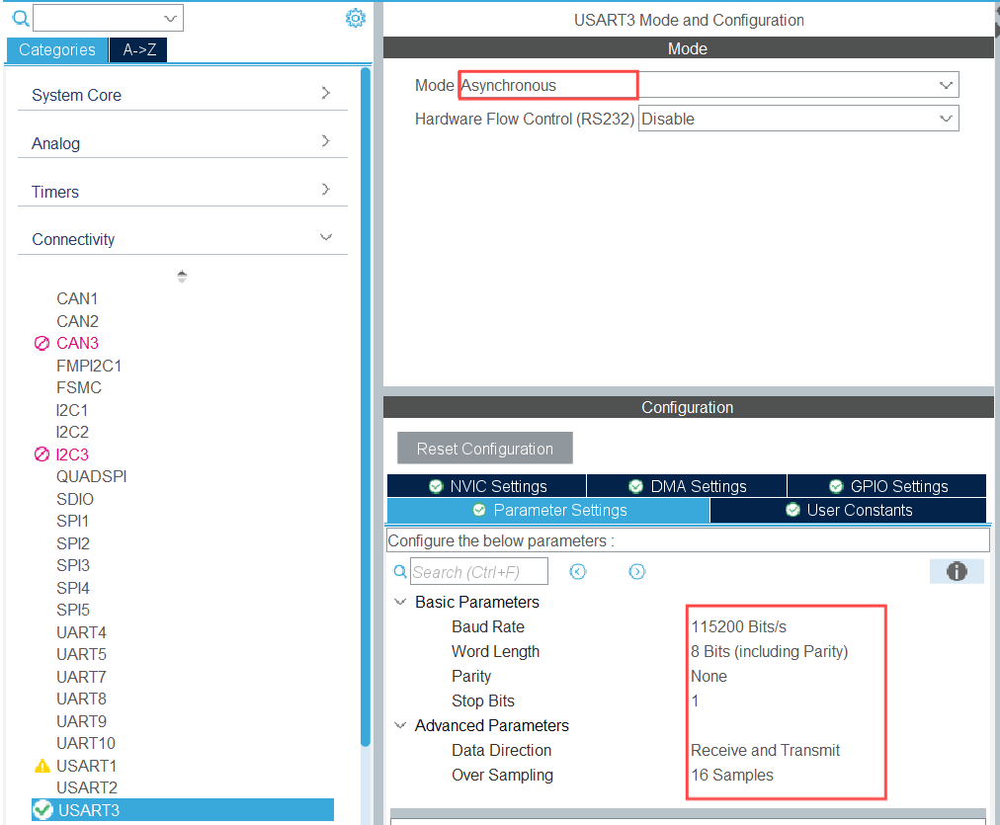
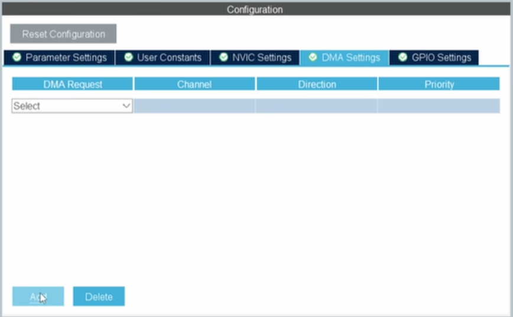
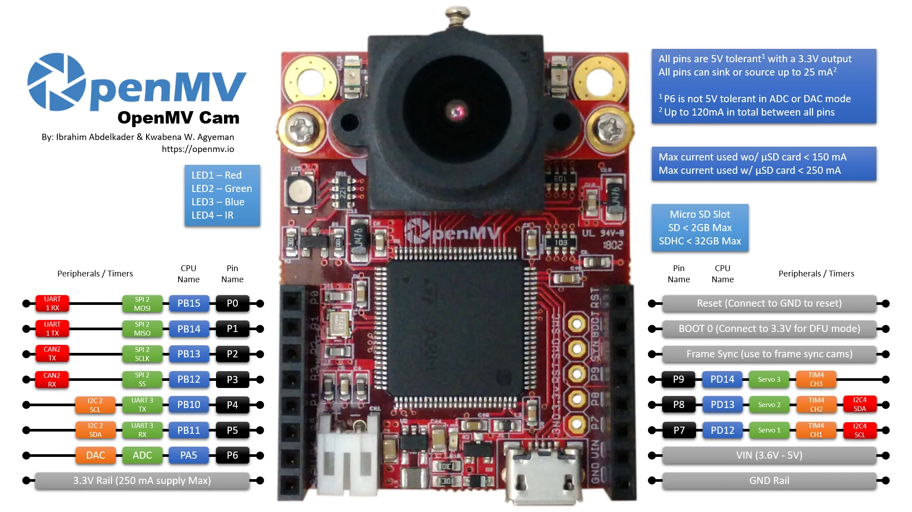

# 第四章 信息邮递员-UART及其应用

## 一、串口启航

### UART介绍：让数据飞！
在前一章我们学习了 GPIO，可以简单地输入输出高低电平实现控制外部设备， 但是在很多需要大量信息交互的场景，需要快速地高低电平的变化才能够在短时 间内传输足够的信息量。为了规范和统一这些传输信息的方式，使得不同的设备 能够直接进行通讯，一系列规则（包括通信线路、数据格式、传输速率等）被制 定出来，这些规则就是**通信协议**。 
串行通信协议中，可以仅仅使用少数几条通信线路，将数据按位依次传输，每位数据占据固定的时间长度，完成系统间交换信息，通信距离可以从几十米到几千米。实际通信过程中，串行协议往往因为其外设简单，成本低而通信距离远更受欢迎。串行通信的通信协议主要有 UART、SPI、I2C 等。本章介绍配置最为简单的 UART，其他协议将在后续章节介绍。 
UART（Universal Asynchronous Receiver Transmitter），即通用异步收发器，是一种通用的串行、异步通信总线。其包含两条数据线，连接两个设备的TX与RX，可实现全双工发送和接收数据操作。实际一般再加上一条线连接二者GND，用于将两设备电势的“0V参考点”校准同步，这种操作被称作**共地**。 异步指的是两设备时钟不需要同步；全双工指的是用了两根独立的数据线使数据收发互不干扰，此外还有单工（只能一方向另一方传输数据）和半双工（两者交替发送，无法同时收发）。
 在使用 UART 进行通信时，两设备连接方式如下图所示：一个设备的 TX（Transmit发送端）连接另一个设备的 RX（Receive接收端），并且两设备**共地**。
   
接下来介绍一下 UART 的通信协议。在通讯之前，双方需要先知道三个数据：波特率，数据长度和起始终止位。

- **波特率**
  - 定义：波特率表示一秒钟内传输/接收的电平信号（码元）数量。
  - 作用：两个设备在UART通信中需要使用相同的波特率，才能保证正确接收数据。
  - 工作原理：接收设备按照已知的波特率进行间隔采样（采样间隔时间为1秒/波特率）从而得到数据。
- **数据帧**是UART通信中传输的基本单位，包含了起始位、数据位和停止位。一个数据帧的格式如下图所示。
  - 空闲状态：在数据传输之前，数据线通常保持在高电平，这时处于空闲状态。
  - 起始位：当数据传输开始时，数据线会从高电平跳到低电平，这一部分被称为起始位。
  - 数据位：紧接着起始位的是实际传输的数据位，通常是8或9个周期。
  - 停止位：数据位之后，紧跟着停止位，用于表示该次传输的结束。  


*UART数据帧格式*   
在开始传输数据之前，通常需要一个短暂的延迟，以确保数据稳定。这时可以通过类似`delay()`的函数来处理，避免采集到不稳定的数据。
以上就是UART通信的基本特点。在设备之间进行通信时，双方必须确保相同的配置，以便能够正常通讯。具体的STM32配置将在下面详细介绍。
另外，STM32中还有USART（universal synchronous/asynchronous receiver&transmitter 通用同步/异步收发器），相比UART，USART支持同步通信模式，并增加了更多功能。对于感兴趣的读者，可以深入了解USART的更多特性。对于初学者来说，USART和UART可以视为功能相似的外设。 

## 二、 控制大师：寄存器的魔法

### 寄存器探秘
本节介绍 UART 常用的寄存器 
首先是**状态寄存器 USART_SR**，如下图所示。该寄存器的各位（Bit）表示了当前 传输过程的状态，例如 TXE 表示发送数据寄存器为空，TC 表示发送完成，RXNE表示读取寄存器不为空，ORE 表示溢出错误，FE 表示帧错误等。
这里我们关注一下两个位，第 5、6 位 RXNE 和 TC。 
1. **RXNE（接收数据寄存器非空）**  
   当该位被置1时，表示USART已经接收到数据，可读取`USART_DR`（数据寄存器）。为了避免数据丢失，应尽快读取`USART_DR`，此操作会自动清除RXNE位。此外，也可以手动向该位写入0来清零。  

2. **TC（发送完成）**  
   当该位被置1时，表示`USART_DR`中的数据已完全发送完毕。如果启用了该位的中断（TC中断），则会触发中断信号。清除TC位的方法有两种：  
   - 方法1：先读取`USART_SR`，再写入`USART_DR`。  
   - 方法2：直接向TC位写入0。 
   

此处提到的清零操作与实际应用相关。需要清零的原因‌是在STM32串口通信中，TC（Transmission Complete）标志位在串口初始化后默认为1。当数据从发送数据寄存器（TDR）完全移到移位寄存器并发送出去后，TC标志位会被置为1。如果不清零TC标志位，新的数据发送请求可能会被误判为不需要发送，导致数据发送覆盖。‌
具体介绍其他各位及其相应状态篇幅过长，感兴趣的读者自行了解。
 
*USART_SR 寄存器 27*  
STM32 的发送与接收是通过数据寄存器 USART_DR 来实现的，这是一个双寄存器，包含了 TDR 和 RDR。当向该寄存器写数据的时候，串口就会自动发送，当收到数据的时候，也是存在该寄存器内。该寄存器的各位描述如下图所示：
 
*USART_DR 寄存器*  
可以看出，虽然`USART_DR`是一个32位的寄存器，但实际上只有低9位（`DR[8:0]`）用于存储数据，其余部分是保留位。  

- **`DR[8:0]`**：包含了串口传输的数据，既包括发送的数据，也包括接收的数据。  
- 由于`USART_DR`是一个双功能寄存器，它由两个部分组成：
  - **TDR**（发送数据寄存器）：用于存放待发送的数据。
  - **RDR**（接收数据寄存器）：用于存放接收到的数据。  

在发送操作时，向`USART_DR`写入数据时，数据会自动写入TDR；而在接收操作时，读取`USART_DR`时，数据会自动从RDR中提取。

此外，UART还包含波特率寄存器、预分频寄存器和三个控制寄存器，这些寄存器共同决定了串口的其他设置，这里不再一一详述，感兴趣的读者可以进一步了解。
### UART库函数
在 `stm32f4xx_hal_uart.h` 文件中，UART 相关的库函数声明如下图所示。实际上，只有最上面的 `Transmit` 和 `Receive` 函数直接与 UART 数据传输相关，其余函数则涉及中断、DMA 等功能。对于初学者来说，在掌握基本的 UART 功能后，可以再深入了解这些高级功能。在实验一中，我们仅使用了 `Transmit` 和 `Receive` 函数，而实验二则涉及了 `Transmit_DMA` 和 `Receive_DMA` 函数。

*部分UART库函数*  
 `HAL_UART_Transmit` 函数用于通过 UART 传输数据。它的声明如下：

```c
HAL_StatusTypeDef HAL_UART_Transmit(UART_HandleTypeDef *huart, uint8_t *pData, uint16_t Size, uint32_t Timeout);
```
它的参数依次为：

1. **UART 句柄**：指定使用的 UART 外设的句柄。例如，在生成的 `usart.c` 文件中，`USART3` 的句柄通常会自动声明为 `UART_HandleTypeDef huart3`。
2. **数据指针**：指向待发送数据的存储区域。这个参数通常是一个数组或字符指针。
3. **数据长度**：需要发送的数据的字节数。例如，如果要发送的字符串有 5 个字符，则填入 5。
4. **超时时间**：指定最大等待时间，单位为毫秒。通常，可以将其设置为最大值 `0xFFFF`，表示没有时间限制。

举个例子，如果你要使用 `USART3` 发送字符数组 `BUF[5] = "good!"` 中的内容，可以调用如下函数：
```c
HAL_UART_Transmit(&huart3, BUF, 5, 0xFFFF);
```
如果你想通过 `USART3` 发送一个变量，比如整数 num = 12345，可以调用如下函数：

```c
    HAL_UART_Transmit(&huart3, (uint8_t*)&num, sizeof(num), 0xFFFF);
```
其中，注意HAL_UART_Transmit() 的函数中pData 是 uint8_t* 类型，所以(uint8_t*)&num 的作用是将 num 的地址转换为 uint8_t* 类型。

同理，`HAL_UART_Receive` 函数用于接收数据，参数与 `HAL_UART_Transmit` 几乎相同，只是第二个参数是接收数据的存储区域指针，用于存放接收到的数据。

简而言之，`HAL_UART_Transmit` 用于发送数据，而 `HAL_UART_Receive` 用于接收数据，二者的调用格式几乎一致，关键在于指定正确的数据存储区和相应的长度。

## 三、 实验1-Hello,STM32!第一个串口通信

### 实验要求  
1. 将开发板与上位机连接，当按下单片机上的按键时，通过 UART 向上位机发送字符串 "SEU"，并在上位机的串口调试助手中显示。
2. 程序同时会监听UART串口的数据接收，一旦接收到数据，就将数据通过UART回传。

### 实验思路  
按键操作与前一章相同，在每次循环中检测按键的高低电平，以判断是否被按下。不同的是，在检测到按键按下后，操作需要改为通过 UART 库函数向上位机发送相应的字符串。

### 初始化配置
**第一步**
设置 `PC13` 为输入模式 (`GPIO_Input`)。
  
**第二步**
右键点击`PC13`将`PC13`的User Label(用户标签)修改为B1（或者其他任何名称），方便后续编程。


`USART3` 保持如下默认配置即可，无需改动。
  


### 主程序代码  
在USER CODE BEGIN 0处，添加如下语句：
```c
/* 检测按键是否按下函数 */
	  uint8_t KeyPressed(void)
	  {
	      if (HAL_GPIO_ReadPin(B1_GPIO_Port, B1_Pin) == GPIO_PIN_SET)
	      {
	          HAL_Delay(20);  // 防抖
	          if (HAL_GPIO_ReadPin(B1_GPIO_Port, B1_Pin) == GPIO_PIN_SET)
	          {
	              while (HAL_GPIO_ReadPin(B1_GPIO_Port, B1_Pin) == GPIO_PIN_SET); // 等待松开
	              return 1;  // 按键按下
	          }
	      }
	      return 0;  // 按键未按下
	  }
```

在USER CODE BEGIN 2处，添加如下语句：
```c
uint8_t rxData;  // 接收数据缓冲区
```

在USER CODE BEGIN WHILE处，添加如下语句：
```c
// 1. 按键按下，发送 "SEU"
      if (KeyPressed())
      {
          uint8_t msg[] = "SEU";
          HAL_UART_Transmit(&huart3, msg, sizeof(msg) - 1, HAL_MAX_DELAY);
      }

      // 2. 轮询 UART 接收数据
      if (HAL_UART_Receive(&huart3, &rxData, 1, 10) == HAL_OK)  // 10ms 超时
      {
          // 3. 回传收到的数据
          HAL_UART_Transmit(&huart3, &rxData, 1, HAL_MAX_DELAY);
      }
```

### 实验结果
将烧录好程序的开发板与电脑连接，打开串口调试助手（如果没有该软件，可以在软件商店搜索“串口调试助手”并下载一个正规版本，功能大致相同）。在串口调试助手中，设置与STM32中初始化`USART3`的**参数一致**，特别注意选择正确的波特率和串口号（即ST-Link对应的串口号）。配置完成后，界面应如下图所示。
    
此时，按下开发板上的按键，串口调试助手的屏幕上应显示"SEU"字符串，通过串口发送任意字符，单片机能接收到这个字符并立即回传，如下图所示，表示实验成功。
   

## 四、 实验2-DMA驾到：不定长数据不再是难题

### 什么是DMA
DMA（Direct Memory Access直接内存访问）用于在外设与存储器之间，或存储器与存储器之间实现高速数据传输。通过 DMA，可以在无需 CPU 参与的情况下快速移动数据，从而节省 CPU 资源，允许 CPU 执行其他任务。
### 实验要求
将开发板与上位机连接，使用上位机的串口调试助手向单片机发送数据。单片机在接收到数据后，将相同的数据返回给上位机，以确认接收成功。
### 初始化配置
**第一步**
在 CubeMX 界面中，进入 USART3 的配置页面，点击 **DMA Settings** 选项卡中的 **Add** 按钮，即可添加 DMA 通道。其中，**TX** 用于 USART3 的发送，**RX** 用于 USART3 的接收。分别添加 TX 和 RX 通道后，保持其余参数为默认值即可。

**第二步**
开启USART3 global interrupt，即后面会学习到的中断.

USART3的其余参数保持默认值即可。
### 主程序代码
由于要接受不定长数据，可以定义一个较大的数组
  
在main函数中用DMA接收数据，我们采用`HAL_UARTEx_ReceiveToIdle_DMA`函数。
```c
HAL_UARTEx_ReceiveToIdle_DMA(UART_HandleTypeDef *huart, uint8_t *pData, uint16_t Size);
```

其中第一个参数和第二个参数与Transmit相同，第三个参数为接收数据的最大长度，一般填写接收数组的长度防止数组越界。
  
当该函数执行完成后，系统会触发中断函数：  

```c
HAL_UARTEx_RxEventCallback(UART_HandleTypeDef *huart, uint16_t Size)
```

在该回调函数中，我们可以处理接收完成后的数据。使用HAL_UART_Transmit_DMA可通过 DMA 发送接收到的数据，同时重新启动 UART 接收，以等待下一次数据传输。

### 实验结果
将烧录好程序的开发板连接至电脑，并打开串口调试助手。确保其参数与 STM32 初始化 USART3 时的配置完全一致，并选择 ST-Link 对应的串口号。此时，在调试助手中输入数据，屏幕应显示单片机接收并回复的数据，如图所示，实验成功。


## 五、 串口万花筒：发现UART的无限可能

### 实验中使用Micro-USB连接线进行UART通信的原因
尽管我们常常提到 UART 通信需要设备之间 **RX 接 TX，TX 接 RX** 并 **共地**，但在这个实验中之所以能够直接通过 Micro-USB 完成通信，是因为开发板的硬件设计中有额外的 **硬件模块** 来“桥接”通信信号。
在这个实验的开发板上，USART3的通信信号从核心 MCU（STM32F413）的 **PD8**（TX） 和 **PD9**（RX） 引出，但它们并没有直接连接到 Micro-USB 接口，而是被引入到另一个芯片（STM32F103）。
STM32F103 芯片是开发板上集成的ST-LINK/V2-1 模块的一部分。ST-LINK 的主要功能包括：  
- **下载和调试功能**：通过 USB 接口与 PC 连接，用于程序的烧录和调试。  
- **虚拟串口功能**（VCP，Virtual COM Port）：将 **USART3 的通信信号** 转换为 **USB 信号**，并通过 Micro-USB 接口传输到 PC（反向也适用）。  

在这里，ST-LINK/V2-1 模块相当于一个 **UART 转 USB 的硬件适配器**，负责桥接 UART 信号和 PC 上的 USB 通信。

由于 ST-LINK/V2-1 模块在硬件上已经完成了 **信号适配与线路连接** 的工作，因此在实验中直接使用 Micro-USB 连接线即可实现 UART 通信，而**无需手动将开发板的 RX 和 TX 引脚接线到 PC 的 USB 转串口模块上**。实验中UART通信的**底层逻辑并未改变，只是隐藏了手动接线的过程**。

### STM32与UART：从调试到项目应用的完美转换
串口不仅是调试的工具，它也是用户和嵌入式系统交互的一种方式。你可以通过串口接受来自用户的输入命令，控制开发板的行为。
应用实例：比如，开发一个串口控制的LED灯具，用户通过PC或上位机向开发板发送命令（例如“开启灯光”、“调节亮度”等），开发板根据接收到的命令控制灯的状态。也可以实现串口通信控制电机、传感器等其他外设。

  
*openmv模块*  
此图是电子类竞赛中常常用作图像识别的openmv摄像头模块，该模块自带一个STM32H7芯片，使用配套的开发环境可以使用python语言编写相关的图像处理的程序，由该模块本身运行，而该模块和系统的核心主单片机之间常常接线、供地使用UART通信。例如系统是一个小车，遇到红灯需要停车，则openmv中编程实现识别红灯并使用UART发送停车的信息，主单片机实现UART接收停车信息后控制车辆停止的功能。

### 串口与无线模块的联动：突破物理界限
通过蓝牙模块,UART接口实现了无线透传功能，简化了设备间的数据连接方式，同时保留了UART协议简单、可靠的特性。这种方法适合需要低功耗、短距离通信的应用场景。
  
*蓝牙模块*  
连接时注意线序正确：TX-RX RX-TX

**蓝牙模块的工作模式： 主从机模式**：一个蓝牙模块设为“主机”（Master），另一个设为“从机”（Slave）。
  - 在建立通信连接前，从机要向外广播自己的信息。
  - 主机扫描到附近正在广播的蓝牙设备后，就发起连接。


**数据的传输过程**
1. 单片机A的UART通过TX将数据发送到连接的蓝牙模块A。
2. 蓝牙模块A将接收到的数据通过无线信号发送到蓝牙模块B。
3. 蓝牙模块B接收无线数据，并通过RX将数据传递给连接的单片机B。
4. 单片机B接收到数据后进行进一步处理。

### 三种常见的数据传输方式
在UART通信中，轮询模式、中断模式和DMA模式是三种常见的数据传输方式，各有优缺点和适用场景。根据项目需求，合理选择合适的模式可以显著提升系统性能和资源利用率。

**工作原理**

 1. **轮询模式（Polling Mode）**  
主机通过不断检查UART的状态寄存器，判断是否有数据可读或数据发送完成。需要接收固定长度的数据。
1. **中断模式（Interrupt Mode）**  
通过启用 UART 的中断功能，当接收或发送完成时触发中断，CPU暂停当前任务去处理UART事件。
具体的中断操作将在下一节中介绍。
1. **DMA 模式（Direct Memory Access Mode）**
通过 DMA 控制器直接将数据从 UART 外设搬运到内存（或反向），无需 CPU 参与传输。


**特性对比**

| 特性           | 轮询模式 | 中断模式   | DMA 模式     |
| -------------- | -------- | ---------- | ------------ |
| **CPU占用**    | 高       | 中         | 低           |
| **实时性**     | 低       | 中         | 高           |
| **实现复杂度** | 简单     | 中         | 较复杂       |
| **适合数据量** | 小       | 中         | 大           |
| **应用场景**   | 简单任务 | 实时性任务 | 高吞吐量传输 |

**如何选择？**
1. **数据量小、任务简单**：选择轮询模式，易于实现。  
2. **实时性要求中等**：选择中断模式，减少 CPU 负担。  
3. **大数据传输且要求高效率**：选择 DMA 模式，解放 CPU。

## 六、 挑战时刻！

### 点亮星空- 串口控制LED闪烁模式 
使用查询 （非中断） 方式, 实现串口接收处理功能, 满足以下要求： 
>   当上位机发送字符'a'时,LD1连续闪烁5次, 每次闪烁问隔 200ms; 
> 当发送字符'b'时, LD2连续闪烁3次, 每次闪烁间隔 500ms; 
> 当发送字符'c'时, LD1和LD2同时闪烁3次, 每次闪烁问隔 300ms; 
> 当发送其他字符时,LD1和LD2保持当前状态。

::: info 本章修改记录   
2025/2 完成编写 (张佳、杨子骞、孙苡朔)   
2025/3 网页适配 (顾雨杭) :::