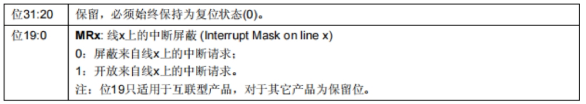

# 第五章 穿越时空的旅程-中断及其应用

## 一、正片开始: 中断

​    在现实生活中，当我们在执行一个主线任务（比方说学习），总会有这样或那样的事情出现打断我们的主线任务（比方说学生工作，被喊去打游戏等等），迫使我们暂停我们的主线任务，去执行其他的任务。在执行任务时我们要考虑其他任务执行的先后顺序，并且在执行完其他任务之后我们要回归主线任务。单片机的中断原理也是如此。中断就是单片机正在执行程序时，由于内部或外部事件的触发，打断当前程序，转而去处理这一事件，当处理完成后再回到原来被打断的地方继续执行原程序的过程。

（1）中断与NVIC

   中断的流程：保存现场——>确定中断源——>执行中断函数——>恢复现场——>继续执行产生中断时的工作。

   在这个流程中，我们如果接收到多个中断源，那么我们如何来确定这些中断源的先后顺序呢（问题A）？同时我们如何确定一个中断源应该对应哪一个中断函数（问题B）？这时候就需要我们的NVIC（又称嵌套向量中断控制器）出场了。

NVIC的主要作用：

1. 掌管如下的一张中断向量表，中断向量的方向就是指向中断处理函数。这样一来我们就能知道一个中断信号应该对应什么中断函数，问题B就解决了。

| 名称      | 处理函数              |
| --------- | --------------------- |
| EXTI0     | EXTI0__IRQHandler     |
| EXTI1     | EXTI1__IRQHandler     |
| EXTI2     | EXTI2__IRQHandler     |
| EXTI3     | EXTI3__IRQHandler     |
| EXTI4     | EXTI4__IRQHandler     |
| EXTI9_5   | EXTI9_5__IRQHandler   |
| EXTI15_10 | EXTI15_10__IRQHandler |

 

 

2. 允许我们指定各个中断源的重要性顺序，进行优先级顺序的调整，这样问题A也解决了。优先级分为两种，一种为**抢占优先级**，一种为**响应优先级**，数字越小代表的优先级越高。下面来具体说明这两种优先级的应用：

   第一种情况，当两个及以上的中断同时发生时，先比较**抢占优先级**，再比较**响应优先级**，如果前两者都相同就按照向量表中的顺序。

   第二种情况，当一个中断正在执行的同时另一个中断突然发生，此时只比较**抢占优先级**。

补充：NVIC的中断优先级寄存器的4位（0-15）决定，这4位可以进行切分，分为高n位的抢占优先级和低4-n位的响应优先级。

| 分组方式 | 抢占优先级          | 响应优先级          |
| -------- | ------------------- | :------------------ |
| 分组 0   | 0 位，取值为 0      | 4 位，取值为 0 - 15 |
| 分组 1   | 1 位，取值为 0 - 1  | 3 位，取值为 0 - 7  |
| 分组 2   | 2 位，取值为 0 - 3  | 2 位，取值为 0 - 3  |
| 分组 3   | 3 位，取值为 0 - 7  | 1 位，取值为 0 - 1  |
| 分组 4   | 4 位，取值为 0 - 15 | 0 位，取值为 0      |

 

（2）外部中断与 EXTI 

外部中断是中断的一种，中断源主要为 IO 口连接的外部信号（当然也有别的中断源，不太常用，此处不再赘述），当外部信号发生变化（例如按下一个按键）， 产生上升沿或者下降沿，触发中断。STM32中由EXTI，即外部中断/事件控制器来检测各通道并产生中断请求信号发送给NVIC。

## 二、相关寄存器与库函数

（1）EXTI配置

 

| 组件                                 | 输入                                                                                                 | 输出 | 连接对象及线路数量                                                                                                                          |
| ------------------------------------ | ---------------------------------------------------------------------------------------------------- | ---- | ------------------------------------------------------------------------------------------------------------------------------------------- |
| AMBA APB 总线                        | 无                                                                                                   | 无   | 外设接口（1 条连接）                                                                                                                        |
| 外设接口                             | PCLK2、AMBA APB 总线                                                                                 | 无   | 中断屏蔽寄存器（20 条）、请求挂起寄存器（20 条）、软件中断事件寄存器（20 条）、上升沿触发选择寄存器（20 条）、下降沿触发选择寄存器（20 条） |
| 中断屏蔽寄存器                       | 外设接口（20 条）                                                                                    | 无   | 与门（20 条，连接至 NVIC 中断控制器路径上的与门）                                                                                           |
| 请求挂起寄存器                       | 外设接口（20 条）                                                                                    | 无   | 与门（20 条，连接至 NVIC 中断控制器路径上的与门）、或门（20 条，连接至脉冲发生器路径上的或门）                                              |
| 软件中断事件寄存器                   | 外设接口（20 条）                                                                                    | 无   | 或门（20 条，连接至脉冲发生器路径上的或门）                                                                                                 |
| 上升沿触发选择寄存器                 | 外设接口（20 条）                                                                                    | 无   | 边沿检测电路（20 条）                                                                                                                       |
| 下降沿触发选择寄存器                 | 外设接口（20 条）                                                                                    | 无   | 边沿检测电路（20 条）                                                                                                                       |
| 与门（连接至 NVIC 中断控制器路径上） | 中断屏蔽寄存器（20 条）、请求挂起寄存器（20 条）                                                     | 无   | 至 NVIC 中断控制器（20 条）                                                                                                                 |
| 与门（连接至脉冲发生器路径上）       | 脉冲发生器（20 条）                                                                                  | 无   | 或门（20 条，连接至脉冲发生器路径上的或门）                                                                                                 |
| 或门（连接至脉冲发生器路径上）       | 请求挂起寄存器（20 条）、软件中断事件寄存器（20 条）、事件屏蔽寄存器（20 条）、边沿检测电路（20 条） | 无   | 脉冲发生器（20 条）                                                                                                                         |
| 事件屏蔽寄存器                       | 无                                                                                                   | 无   | 或门（20 条，连接至脉冲发生器路径上的或门）                                                                                                 |
| 边沿检测电路                         | 上升沿触发选择寄存器（20 条）、下降沿触发选择寄存器（20 条）、输入线                                 | 无   | 或门（20 条，连接至脉冲发生器路径上的或门）                                                                                                 |
| 脉冲发生器                           | 无                                                                                                   | 无   | 与门（20 条，连接至脉冲发生器路径上的与门）                                                                                                 |
| 输入线                               | 无                                                                                                   | 无   | 边沿检测电路                                                                                                                                |

 							      				EXTI基本框图

首先介绍EXTI的几个重要的寄存器。   

中断屏蔽寄存器 **EXTI_IMR**决定了 EXTI各线上的中断请求是否屏蔽,即事先配置的各通道的中断事件产生时，是否做出响应。



（摘自[STM32——中断篇_stm32中断-CSDN博客）](https://blog.csdn.net/weixin_52706451/article/details/138413887?ops_request_misc=%7B%22request%5Fid%22%3A%22e7ce11ec161368d8e83c6ef28c34303a%22%2C%22scm%22%3A%2220140713.130102334..%22%7D&request_id=e7ce11ec161368d8e83c6ef28c34303a&biz_id=0&utm_medium=distribute.pc_search_result.none-task-blog-2~all~sobaiduend~default-1-138413887-null-null.142^v101^pc_search_result_base9&utm_term=中断简介&spm=1018.2226.3001.4187)

**上升沿触发选择寄存器 EXTI_RTSR**以及与之结构类似的**下降沿触发选择器**

**EXTI_FTSR**则共同决定了外部中断的另一个重要属性--该中断是由外部信号的上升沿还是下降沿触发。


（摘自[STM32——中断篇_stm32中断-CSDN博客](https://blog.csdn.net/weixin_52706451/article/details/138413887?ops_request_misc=%7B%22request%5Fid%22%3A%22e7ce11ec161368d8e83c6ef28c34303a%22%2C%22scm%22%3A%2220140713.130102334..%22%7D&request_id=e7ce11ec161368d8e83c6ef28c34303a&biz_id=0&utm_medium=distribute.pc_search_result.none-task-blog-2~all~sobaiduend~default-1-138413887-null-null.142^v101^pc_search_result_base9&utm_term=中断简介&spm=1018.2226.3001.4187)）

当 EXTI收到中断请求时，**挂起寄存器 EXTI_PR**的相应端口会置为 1，该寄存器的内容与屏蔽寄存器的内容送至 NVIC，由 NVIC管理中断事件，后续产生响应。值得一提的是，每次中断处理完成后都需要清掉该位以等待下一次中断。

除此以外，EXTI还有软件中断以及产生事件等功能，此处不再赘述，感兴趣的读者可以自行了解。

​    接下来介绍在图形化界面中如何配置。打开 CUBEMX 或者 CUBEIDE，找到 GPIO 中的 PC13，可以发现 PC13 的默认 GPIO mode 为 External Interrupt Mode with Rising edge trigger detection,即上升沿触发的外部中断模式。这是ST已经根据这个开发板的属性为我们配置好的默认配置。在GPIO章节中曾经结合原理图解释过，当按键未按下时 PC13 为低电平，按下时为高电平，因此按下按键电平由低变高，于是此处按下按键即产生一个 PC13 的上升沿，触发中断。


​    不过在默认状态下，EXTI的中断并没有被使能，我们需要在 NVIC中勾选Enabled，配置的外部中断才能生效。如果需要配置其他 GPIO，均是相同的流程，先根据触发条件选择GPIO Mode中的相应模式，再使能外部中断就初始化完成了。				


​    以上为外部中断的初始化。接下来就是中断程序的编写，即中断响应后，单片机需要执行的部分。

​    初始化生成模版后，在自动生成的文件 stm32f4xx_it.c中，可以看到如下图5-7所示的函数 EXTI15_10_IRQHandler，当 EXTI检测到中断，并且通过 NVIC的处理之后送至处理器之后，将会跳转至执行这个函数。具体处理器如何能够精准地根据中断类型跳转至对应中断程序处的原理，感兴趣的读者可以自行查阅资料了解。可以看到，这个函数嵌套了另一个 HAL_GPIO_EXTI_TRQHandeler的库函数，该库函数可以在 stm32f4xx_hal_gpio.c文件中找到定义，如下图所示。


​    从函数定义中可以看出，主要有两个步骤，第一，调用库函数HAL_GPIO_EXTI_GET_IT库函数判断中断标志位（即挂起寄存器中的对应位）是否为 1，无误后首先执行清除标志位（将挂起寄存器中对应位置 0），表示该中断已处理，此后等待接受下一次的该中断。第二，调用中断回调函数HAL_GPIO_EXTI_Callback,在下方可以看到该函数的定义，如下图 5-9所示。默认情况下没有有效程序，是留给开发者自行编写的功能部分，即整个中断流程最重要的：检测到中断后具体执行的操作。该函数有前缀“weak”，表示其为弱函数（弱函数补充：在STM32库函数中，weak函数是一种特殊的函数类型。它允许用户在自己的应用程序中定义具有**相同名称的函数**，以**覆盖**库函数的默认实现weak函数是一个弱符号（weak symbol），它是一个具有默认实现的函数。当链接器在编译时遇到具有相同名称的函数定义时，它**首先选择用户定义的函数**而不是库函数。**如果用户没有定义该函数，那么库函数的默认实现将被使用**），通常在 main文件中重写该函数。

​    在中断处理程序的设计中，看似冗余的多层嵌套结构，实则暗藏玄机，为开发者提供了极大的便利。这种设计思路在库函数开发中尤为常见，因为已封装好的库函数往往不需要频繁修改，开发者只需在主程序中实现自定义的中断处理逻辑即可。具体来说，这种设计分为两个关键步骤：

​    首先，库函数中封装了各外设的中断处理函数，其中包含了每次中断时必须执行的固定操作，例如清除标志位等。同时，将需要开发者自定义的回调函数定义为弱函数，开发者只需在主程序中重写这些回调函数即可。

​    其次，程序模板根据开发者所需的中断类型生成对应的中断处理函数，并在其中调用库函数中的中断处理函数。这种设计不仅“保护”了库函数，避免了直接修改库函数的需求，还为开发者提供了一种清晰的路径：从主程序到库函数，再回到主程序。通过这两道桥梁，开发者无需关心繁琐的中断配置，只需专注于实现具体的功能逻辑。

​    这种设计巧妙地结合了库函数和图形化工具的优势，既保证了代码的模块化和可维护性，又极大地简化了开发流程。读者可以细细品味其中的精妙之处，体会这种设计在开发效率和代码结构上的双重优势。

（2）NVIC

​    在图形化配置工具中，NVIC（嵌套向量中断控制器）的设置变得异常简便，因此无需深入探讨其具体寄存器的细节。图5-10展示了CUBEMX中NVIC的配置界面，开发者可以直观地调整各中断的相关属性。其中，“Enabled”选项用于使能中断，例如前文在GPIO配置中勾选的EXTI中断使能，与此处EXTI项的“Enabled”实际上是同一设置，图中已显示使能成功。

​    “Preemption Priority”表示抢占优先级，而“Sub Priority”则为响应优先级。默认情况下，所有中断的这两个优先级是相同的。若需调整优先级，只需在对应中断的优先级栏中修改数值即可（数值越小，优先级越高）。感兴趣的读者可以在学习其他类型的中断后，尝试设计可能产生冲突的中断场景，并通过设置不同的优先级来验证其功能。这种实践不仅能加深对中断机制的理解，还能帮助掌握优先级调度的实际应用。


（3）相关库函数介绍

1.`void HAL_Delay(uint32_t Delay)`：用于实现延时功能，里面填写数字，单位为毫秒，无返回值。

2.`void HAL_GPIO_WritePin(GPIO_TypeDef *GPIOx, uint16_t GPIO_Pin, GPIO_PinState PinState)`：用于设置 GPIO 口电平状态的函数，内含三个参数。第一个参数填写GPIO 端口号，第二个填写GPIO 引脚号，第三个填写GPIO 引脚状态，可选值有`GPIO_PIN_RESET`（低电平）和`GPIO_PIN_SET`（高电平），用于设置指定引脚的电平，无返回值。

3.`GPIO_PinState HAL_GPIO_ReadPin(GPIO_TypeDef *GPIOx, uint16_t GPIO_Pin)`：用于读取指定 GPIO 引脚的电平状态，内含两个参数。第一个填写GPIO 端口号。第二个填写GPIO 引脚号，返回值为GPIO_PIN_RESET（低电平）或GPIO_PIN_SET（高电平）。

4.`void HAL_GPIO_TogglePin(GPIO_TypeDef *GPIOx, uint16_t GPIO_Pin)`：用于将指定 GPIO 端口的指定引脚的当前电平状态进行反转。内含两个参数。第一个填写GPIO 端口号。第二个填写GPIO 引脚号，无返回值。

5.`void HAL_GPIO_EXTI_Callback (uint16_t GPIO_Pin ) `：用于指定触发外部中断的 GPIO 引脚号。，内含一个参数，填写GPIO端口号。

6.`void HAL_UART_RxCpltCallback(UART_HandleTypeDef *huart)`：用于处理 UART（通用异步收发传输器）接收完成回调的函数。当使用 HAL 库的 UART 接收函数（如` HAL_UART_Receive_IT`以中断方式接收数据），并且指定数量的数据接收完成后，HAL 库会自动调用`HAL_UART_RxCpltCallback`函数。用户可以在这个回调函数中编写自己的代码来处理接收到的数据，比如对数据进行解析、存储或者触发其他操作。参数是指向`UART_HandleTypeDef`结构体的指针类型。

## 三、 实验1-古代掌管点灯的中断之神

### 实验目的

学习外部中断原理与应用

### 实验要求

运用外部中断的方法，通过按键输入信号控制LED灯的亮灭（即按一次按键LED亮，再按一次按键LED灭）

### 实验思路

根据外部中断方式，配置好对应按键的输入模式，再在对应的中断回调函数中写入亮灭灯的代码，最后通过烧录完的实现效果即可判断实验成功与否

### 初始化设置

**第一步**
首先打开 STM32CubeIDE 工具，新建工程,按照下图步骤选择我们的板子NUCLEO-F413ZH，然后点击下一步。


对我们的工程起一个名字，这里我就以"TEST1"命名，然后点击finish


此时若界面蹦出来询问我们是否需要给外设初始模式，我们选择yes

**第二步**
我们在图形化界面中打开GPIO，找到PC13，将其输入模式改为上升沿触发的外部中断模式（即External Interrupt Mode with Rising edge trigger detection）。此时根据GPIO原理图，按键在未按下时为低电平，按下时为高电平(附图一)


**第三步**
接着打开NVIC，在其中选择EXTI line[15:10]interrupts将其勾选为Enabled状态，即可使能外部中断，完成初始化。如需配置其他GPIO，流程与上述相似。（附图二）


### 主程序代码 

生成代码后，在/* USER CODE BEGIN 4 */下方添加如下代码： 
```
1. void HAL_GPIO_EXTI_Callback (uint16_t GPIO_Pin ) //外部中断的中断回调函数 
2.{ 
    if (GPIO_Pin == GPIO_PIN_13) //如果是PIN13引脚产生的中断 
    {
         HAL_GPIO_TogglePin ( LD1_GPIO_Port ,LD1_Pin ); //翻转LED引脚电平
    }
  } 
```
  如前文所说,本处是为中断回调函数的重写。在函数内判断是否为PC13引起的中断,如果是则执行翻转LD1电平的操作。
 第一次按下按键，低电平转为高电平，输入一个上升沿信号，触发中断使信号灯亮起；再次按下翻转电平，使得LD1熄灭

### 实验结果

编译、烧录后启动程序，观察到一开始LED不亮，按下对应按键后LED亮起，再次按下按键LED熄灭，则实验成功

## 四、实验2-串口中断实验

### 实验目的

学习串口中断原理与应用

### 实验要求

在了解完外部中断的基本原理后，进一步尝试通过串口来接收特定数据触发中断回调函数，实现点灭灯的操作

### 实验思路

设置变量接收由串口传入的数据并进行判断，当输入数据为特定值时触发中断回调函数，在函数中执行LED引脚电平翻转的函数，最后通过烧录完的实现效果即可判断实验成功与否

### 初始化设置

**第一步 配置串口**

在 "Pinout & Configuration" 视图中，点击 "Connectivity" -> "USART2"。
将 "Mode" 设置为 "Asynchronous"。
在 "NVIC Settings" 选项卡中，勾选 "USART2 global interrupt" 使能串口中断。


**第二步 配置 GPIO**

在 "Pinout & Configuration" 视图中，点击 "System Core" -> "GPIO"。
选择 LED 对应的 GPIO 引脚（本实验选择 PA5），将其设置为 "Output Push Pull"。

### 编写用户代码

在 "Core/Src/main.c" 文件中，找到 `/* USER CODE BEGIN PV */` 和 `/* USER CODE END PV */` 之间的部分，添加以下变量：
```c
        uint8_t rx_data;//该变量用于存储通过串口接收到的大小为1字节的数据
```
找到 `/* USER CODE BEGIN 0 */` 和 `/* USER CODE END 0 */` 之间的部分，添加以下串口中断回调函数：
```
        void HAL_UART_RxCpltCallback(UART_HandleTypeDef *huart)//该函数在接收到数据后开始调用串口中断回调函数
        {
          if (huart->Instance == USART2)
          {
            if (rx_data == 'A') // 如果接收到字符 'A'
            {
              HAL_GPIO_TogglePin(GPIOA, GPIO_PIN_5); // 翻转 LED 状态
            }
            HAL_UART_Receive_IT(&huart2, &rx_data, 1); // 重新开启串口接收中断
          }
        }
```
在 /* USER CODE BEGIN 2 */` 和 `/* USER CODE END 2 */` 之间的部分，添加以下代码开启串口接收中断：
```
        HAL_UART_Receive_IT(&huart2, &rx_data, 1);
```

### 实验结果

使用串口调试助手（例如 Putty、Tera Term）连接开发板串口。
设置串口参数为 115200 8N1（与代码中设置的一致）。
发送字符 'A'，观察到LED亮起，再次发送'A'观察到LED熄灭。
尝试发送其他字符或数字，此时LED均无反应。

## 五、 看，外部中断大放光彩！

实际中外部中断广泛地运用在**键盘、遥控等外部设备和单片机的交互**中（其他类型中断的应用往往与该外设相关，此处不再赘述）。如图（a）所示为一种常用的 4X4 薄膜*键盘*，在实际的系统中，需要用户输入数据或者设置模式等操作往往需要键盘，该键盘的 8 根信号线分别对应 4行和 4 列，其原理图读者可以自行上网查询。开发者可以将行线设置为 EXTI 模式，列线设置为高电平输出，当某键按下时产生该行线上升沿，触发中断，执行相关操作。图 （b）为一种*红外遥控器*，用户可以借助其实现远程控制系统的功能，开发者可以设置红外接收器的一个引脚EXTI 模式，当红外接收器接收到遥控器发出的信号时，该引脚电平发生变化，触发中断，在中断程序中解析红外编码，再实现相应操作。图 （c）为一种*触摸屏*，通过一个引脚设置为EXTI 模式，当用户触摸时该引脚产生一个低电平，触发中断，在中断函数中获取触摸点坐标并且进行后续操作。感兴趣的读者可以上网更多资料了解。当然，以上模块可能不仅有外部中断种方式实现，事实上很多模块都有多种驱动方式，读者可以在开发中使用不同方式感受不同外设的优缺点。


## 六、请玩家解锁此挑战

请用**中断**的方式
1. 实现如下要求：
   1. 当上位机向开发板发送字符‘a’时，LD1 点亮
   2. 当发送字符‘b’时，LD2点亮
   3. 当发送‘c’时 LD1、LD2 同时熄灭
   4. 发送其他字符时两灯状态不变
2. 若要求改为发送字符串“one”LD1 亮，“two”LD2 亮，“off”两灯熄灭，代码该如何修改。

::: info 本章修改记录 

2025/2 完成编写 (薛晨烨、吕允成、张凤茹)

2025/3 网页适配 (顾雨杭) :::
