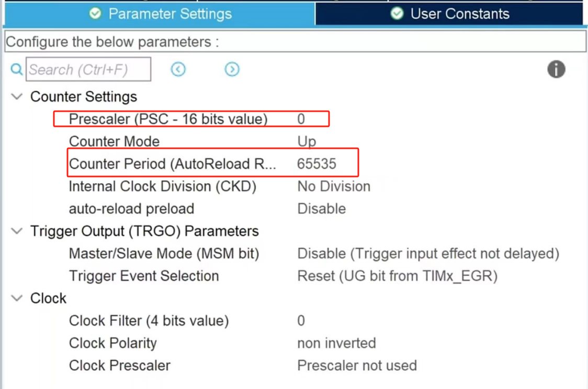

# 第六章 时间守护者-定时器及其应用

## 一、 乘凉时钟树下,聆听滴答之声

这一章,我们将向大家介绍如何使用STM32的通用定时器,STM32的定时器功能十分强大,包括通用定时器、高级定时器等类型。
在《STM32参考手册》里面,定时器的介绍占了1/5的篇幅,足见其重要性。

### 时钟树

在介绍定时器之前，我们首先需要了解单片机的时钟树。时钟树是STM32微控制器的核心，它负责管理和分配时钟信号，为CPU、总线以及各种外设（如定时器、串口等）提供工作时钟。

时钟树是STM32内部的一个复杂网络，包括时钟源（用于生成精确脉冲）、锁相环（用于倍频）、时钟分频器以及时钟分配网络。时钟源提供系统所需的基础时钟信号，锁相环用于提高时钟频率并稳定输出，分频器将时钟信号分频以满足不同外设的时钟需求，时钟分配网络则将时钟信号分发到各个外设。

通过各个内部单元的配合，时钟树将不同的时钟源（如内部振荡器、外部晶振等）通过分频、倍频等方式，分配到各个外设和总线。时钟树的设计使得开发者可以根据需求灵活配置系统时钟，从而在性能和功耗之间找到最佳平衡。

在STM32CubeIDE的可视化界面中，我们可以直观地查看时钟树的整体结构，并通过调整相关参数灵活地修改时钟树各个分支的时钟频率，这样就可以方便地优化系统时钟配置，以满足不同外设和应用的需求。


### 定时器介绍

STM32的定时器功能极为丰富且强大，可以实现多种应用，包括定时、计数、PWM输出等。STM32微控制器通常会提供多种类型的定时器，其中最常见的包括通用定时器、高级定时器和基本定时器。每种定时器都具有独特的功能和应用场景。

通用定时器，顾名思义，适用于一般的定时任务，它支持定时、计数、捕获输入信号和比较输出等功能，广泛应用于测量时间间隔、生成PWM波形、计数外部事件等场景。高级定时器相比通用定时器提供了更多的功能，通常应用于更为复杂的控制系统。与通用定时器和高级定时器相比，基本定时器的功能较为简单，通常用于生成周期性的中断，适用于较为基础的定时任务。

在STM32中，定时器不仅支持定时和计数，还可以通过不同的工作模式满足多样的需求。

定时器可以工作在单次模式或周期模式下。单次模式适用于需要一次性触发事件的场景，例如测量某个时间段的时间或外部事件的发生，而周期模式则用于持续性任务，比如周期性执行的控制任务。

定时器还支持捕获和输出比较模式，捕获模式用于记录外部信号的时间戳，适合测量脉冲宽度、频率等；输出比较模式则用来在定时器计数到某个值时触发输出，广泛用于生成PWM信号。这些工作模式使得STM32的定时器功能可以适应从简单到复杂的各种应用。

在实际应用中，定时器的配置和使用通常需要根据具体的需求来决定。例如，在需要精确控制时间间隔的情况下，可以选择配置通用定时器或高级定时器，调整其分频器和计数器的值，从而实现所需的定时功能。定时器的配置往往可以通过STM32CubeMX工具来实现，开发者只需要选择相应的时钟源、分频系数和计数模式即可；而对于一些更复杂的应用，开发者也可以直接通过编程方式配置定时器的寄存器，精确控制定时器的行为。通过灵活的配置和调度，STM32的定时器能够满足多种不同的应用需求，无论是在低功耗、精确控制还是高频率信号生成等方面，STM32的定时器系统都能够提供强大的支持。


在定时器的应用中，有许多经典的场景，比如时间管理、PWM控制、外部信号捕获等。通过配置合适的工作模式和参数，STM32能够精确地控制外设和任务的执行，尤其是在要求精确时序的场合，定时器的作用尤为重要。例如，通过定时器生成的PWM信号，可以调节电机的转速；通过输入捕获功能，定时器可以精确测量外部传感器的信号特征，用于频率或脉宽测量。这些定时器的应用让STM32能够广泛地应用于从家电控制到工业自动化、从机器人控制到数字信号处理等各种领域。

## 二、  记忆的密码：寄存器与函数详解

### 界面介绍


在定时器的设置中，Slave Mode（从模式）与Trigger Source（触发源）这两项，一般情况下无需特意配置，维持默认的Disable状态即可。而Clock Source（时钟源）的设置则较为关键。

对于高级定时器而言，它具备**四种**不同的时钟源选项，分别为**内部时钟源、外部时钟模式1（借助外部输入引脚TIx）、外部时钟模式2（通过外部触发输入ETR）以及内部触发输入（ITRx）**。相比之下，通用定时器所拥有的时钟源种类会稍少一些。时钟源的频率，作为定时器计时的基础，起着决定性作用。在本章的实验里，选用的是内部时钟源。

此外，定时器还设有多个通道，这些通道能够实现**输入捕获、输出比较以及PWM等功能**。在实际应用时，可依据具体需求来进行选择。在本次实验中，将会用到PWM产生功能。上述所提及的模式、通道等详细信息，均存储于相关的多个控制寄存器之中。鉴于这些寄存器的配置较为复杂，在此就不展开细说了。

在下方的参数设置里，主要涵盖Counter Settings（计数设置）和Trigger Output（触发输出）这两个部分。由于在本章的实验中，并不需要对触发输出相关的配置进行调整，所以保持默认状态即可。我们重点需要关注的是Counter Settings（计数设置）这一部分，因为它决定了定时器具体的**计数方式**。

### 相关寄存器

#### 1. **TIMx_CR1（控制寄存器1）**

   - **功能**：
     - 控制计数与更新事件：通过CEN位使能或禁止计数器计数，计数器在计数过程中达到自动重载值等条件时会产生更新事件，更新事件可用于触发其他操作，如**更新寄存器值、产生中断等。**

     - 配置计数模式：DIR位用于配置**向上或向下计数模式**，不同计数模式决定了计数器的计数方向和更新事件产生的时机。OPM位可设置单脉冲模式，在该模式下产生一次更新事件后定时器停止，这对于一些需要单次定时操作的场景很有用。
   - **关键位**：
     - **CEN**（Counter Enable）：启动/停止计数器。
     - **DIR**：计数方向（0=向上，1=向下，取决于模式）。
     - **OPM**（One Pulse Mode）：单脉冲模式使能。
     - **ARPE**（Auto-reload preload）：自动重载预装载使能。

#### 2.  TIMx_CR2（控制寄存器2）：

  - **功能**： 主要用于控制定时器的输出和从模式等功能，如选择输出模式、触发输出等。

#### 3. **TIMx_PSC（预分频器寄存器）**

   - **功能**：该寄存器也是16位的，可设置的值范围为0到65535。定时器的时钟频率经过预分频后才用于驱动计数器计数并且对输入时钟分频，决定计数器的计数频率。
   - **公式**：`计数器频率 = 输入时钟频率 / (PSC + 1)`
   - **使用**：Prescaler（预分频系数）扮演着重要角色，它能够将来自时钟源的时钟信号，经过预先分频处理后，生成频率更低或者数值更为适宜的信号，以便后续使用。

#### 4. TIMx_ARR（自动重载寄存器）

   - **功能**：它决定了定时器的定时周期。在向上计数时，计数器达到此寄存器的值就产生更新事件；向下计数时，从该值开始减到0产生更新事件。可以设置计数器溢出值，决定定时周期。
   - **公式**：`定时周期 = (ARR + 1) * (PSC + 1) / 输入时钟频率`
   - **解释**：  
- **ARR + 1** 是计数器需要计数的次数。例如，设置 `ARR = 9999`，表示计数器从 0 到 9999 共计数 10000 次。  
- **PSC + 1** 是分频系数，与 ARR 共同决定总定时周期。  
- **输入时钟频率** 是未分频的原始时钟频率（如 72 MHz）。
- **使用**：调整Counter Period即可调整计数**最大值**


#### 5. **TIMx_CNT（计数器寄存器）**

   - **功能**：该寄存器是16位或32位的（取决于定时器），在**向上计数模式**下，计数器从0开始，每来一个时钟脉冲就加1，直到达到自动重载寄存器的值后产生更新事件，然后重新从0开始计数。在**向下计数模式**下则从自动重载值开始递减计数到0。

#### 6. **TIMx_SR（状态寄存器）**

   - **功能**：
     - 标志事件发生：该寄存器中的各个标志位用于指示各种事件的发生情况，如更新标志位（UIF）在发生更新事件时置1，输入捕获标志位（CCxIF）在相应通道发生输入捕获事件时置1，输出比较标志位在输出比较事件发生时置1等。这些标志位可用于软件查询来判断是否发生了相应事件，也可用于**触发中断**。

     - 配合产生中断：当相应的事件标志位置1后，如果在中断使能寄存器中对应的中断使能位也被置1，则会产生中断请求，从而使CPU可以及时响应并处理相应事件。
   - **关键位**：
     - **UIF**（Update Interrupt Flag）：更新中断标志（溢出时置1）。

#### 7. **TIMx_CCMR1/CCMR2（捕获/比较模式寄存器）**

   - **功能**： 主要用于配置定时器捕获/比较通道1和通道2的工作模式、输入输出状态等。
   - **关键位**：
     - **OCxM**（Output Compare Mode）：**设置PWM模式（如PWM模式1或2）**。
     - **CCxS**（Capture/Compare Selection）：选择通道模式（输入/输出）。

#### 8. **TIMx_CCRx（捕获/比较寄存器）**

   - **功能**：在输入捕获模式下，当检测到指定的输入信号沿时，定时器会将当前计数器的值锁存到捕获/比较寄存器中。在输出比较模式下，当计数器的值与捕获/比较寄存器的值相等时，根据设置的输出比较模式，会对输出引脚的电平进行相应的操作，如**翻转、置高、置低等。**

---

### HAL库常用函数

#### 1. **初始化与启动**

   ```c
   // 初始化定时器基参数（时钟源、分频、计数模式等）
   HAL_TIM_Base_Init(TIM_HandleTypeDef *htim);
   
   // 启动定时器
   HAL_TIM_Base_Start(TIM_HandleTypeDef *htim);      // 无中断
   HAL_TIM_Base_Start_IT(TIM_HandleTypeDef *htim);   // 使能更新中断

   // 获取计时器值
   __HAL_TIM_GET_COUNTER(TIM_HandleTypeDef *htim);

   //串口发送函数
   HAL_UART_Transmit(TIM_HandleTypeDef *htim,const uint8_t*pData,Size,Timeout)

   //串口中断发送函数
   HAL_UART_Transmit_IT(TIM_HandleTypeDef *htim,const uint8_t*pData,Size)

   //延时
   HAL_Delay(Delay)；

   //设置计数器的值
   __HAL_TIM_SET_COUNTER(TIM_HandleTypeDef *htim, uint32_t Counter)；

   //获取重装载寄存器的值
   __HAL_TIM_GET_AUTORELOAD(TIM_HandleTypeDef *htim)；

   //设置定时器的自动重装载值
   __HAL_TIM_SET_AUTORELOAD(TIM_HandleTypeDef *htim,Size)；

   //设置预分频器的值
   __HAL_TIM_SET_PRESCALER(TIM_HandleTypeDef *htim,Value)；

   ```

#### 2. **PWM配置**

   ```c
   // 初始化PWM通道
   HAL_TIM_PWM_Init(TIM_HandleTypeDef *htim);
   
   // 启动PWM输出
   HAL_TIM_PWM_Start(TIM_HandleTypeDef *htim, uint32_t Channel);

    // 停止PWM输出
   HAL_TIM_PWM_Stop(TIM_HandleTypeDef *htim, uint32_t Channel);
   
   // 设置占空比（通过修改CCR值）
   __HAL_TIM_SET_COMPARE(&htim, TIM_CHANNEL_x, duty_cycle);

   //定时器底层初始化回调函数
    HAL_TIM_MspInit(TIM_HandleTypeDef* htim)
   ```

#### 3. **中断处理**

   ```c
// 定时器中断处理函数（在stm32xx_it.c中调用）
void TIMx_IRQHandler(void) {
    HAL_TIM_IRQHandler(&htim);
}

// 溢出中断回调函数（用户重写）
void HAL_TIM_PeriodElapsedCallback(TIM_HandleTypeDef *htim) {
    if (htim->Instance == TIMx) {
        // 处理定时中断任务
    }
}
   ```

#### 4. **其他功能**

   ```c
   // 输入捕获配置
   HAL_TIM_IC_Init(TIM_HandleTypeDef *htim);
   HAL_TIM_IC_Start_IT(TIM_HandleTypeDef *htim, uint32_t Channel);
   
   // 直接操作寄存器（例如手动更新ARR）
   TIMx->ARR = new_value;  // 修改自动重载值
   TIMx->EGR |= TIM_EGR_UG; // 触发更新事件

   //获取定时器标志位状态
   __HAL_TIM_GET_FLAG(TIM_HandleTypeDef *htim,Flag);

   //清0标志位的函数
   __HAL_TIM_CLEAR_FLAG(TIM_HandleTypeDef *htim,Flag);

   //写入电平状态
   HAL_GPIO_WritePin(GPIO_TypeDef* GPIOx, uint16_t GPIO_Pin, GPIO_PinState PinState)

   //读取电平状态
   HAL_GPIO_ReadPin(GPIO_TypeDef* GPIOx, uint16_t GPIO_Pin) 

   //初始化定时器的基本参数
    HAL_TIM_Base_Init(&htim) 

   //读取寄存器的值
   HAL_TIM_ReadCapturedValue(TIM_HandleTypeDef* htim, uint32_t Channel)

   //启动编码器
   HAL_TIM_Encoder_Start(TIM_HandleTypeDef* htim, uint32_t Channel)

   ```

## 三、 实验1-前进还是停止？用三色小灯模拟信号灯：定时器中断实验

### 实验概述

利用开发板上的LD1（绿）、LD2（蓝色模拟黄色）和LD3（红）来模拟交通信号灯，实现红灯亮5秒后熄灭，绿灯亮5秒后熄灭，蓝灯亮2秒后熄灭依次进行。

### 实验目的

1. 学习定时器中断的配置方法
2. 实现LED灯按频率依次亮起和熄灭

### 实验思路

通过STM32的定时器中断功能来模拟交通灯的红、绿、蓝灯切换。首先，初始化定时器，使其每隔一定时间触发一次中断。接着，在主程序代码中，开启定时器中断，并重新定义中断回调函数，在中断回调函数中进行逻辑处理，根据当前交通灯的状态（红灯、绿灯或蓝灯）和计时器的计数值，控制LED灯的亮灭来切换交通灯状态。

### 实验步骤

1. 首先打开 STM32CubeIDE 工具，新建工程。选择对应的NUCLEO-F413ZH开发板，起好工程名称。
2. 我们对时钟树进行配置，配置的数据如图所示

   
3. 完成所需配置。
   在定时器配置界面内配置 TIM2，并将时钟源修改为内部时钟。 


修改 TIM2 时钟参数：

- Prescaler：预分频系数，这里应填写 9599，将 96Mhz 的时钟分频为 10000hz
- Counter Period：计数周期，这里填写 9999，使得定时器约 1000ms 产生一次中断
- auto-reload period ：开启自动装载，定时器将在产生中断后继续重新计数


在中断配置界面将 TIM2 中断开启。


保存并生成代码。

1. 主程序代码
   在USER CODE BEGIN 2处，添加如下语句添加如下语句，开启定时器中断。

```C
HAL_TIM_Base_Start_IT(&htim2);
```

在USER CODE BEGIN PV处定义所需变量。

```c
uint8_t light_state = 0; // 表示三种灯状态：0-红灯，1-绿灯，2-蓝灯
uint8_t second_count = 0; // 秒计数器
```

在USER CODE BEGIN 0或USER CODE BEGIN 4处添加如下语句。

```c
void HAL_TIM_PeriodElapsedCallback(TIM_HandleTypeDef *htim)
{
    if (htim == &htim2) // 确保是TIM2的中断
    {
        second_count++; // 秒计数器加1

        // 根据交通灯状态切换
        switch (light_state)
        {
            case 0: // 红灯
                if (second_count >= 5)
                {
                    light_state = 1; // 切换到绿灯
                    second_count = 0; // 重置计数器
                    HAL_GPIO_WritePin(LD1_GPIO_Port, LD1_Pin, GPIO_PIN_SET); // 绿灯亮
                    HAL_GPIO_WritePin(LD3_GPIO_Port, LD3_Pin, GPIO_PIN_RESET); // 红灯灭
                }
                break;
            case 1: // 绿灯
                if (second_count >= 5)
                {
                    light_state = 2; // 切换到蓝灯
                    second_count = 0; // 重置计数器
                    HAL_GPIO_WritePin(LD2_GPIO_Port, LD2_Pin , GPIO_PIN_SET); // 蓝灯亮
                    HAL_GPIO_WritePin(LD1_GPIO_Port, LD1_Pin, GPIO_PIN_RESET); // 绿灯灭
                }
                break;
            case 2: // 黄灯
                if (second_count >= 2)
                {
                    light_state = 0; // 切换到红灯
                    second_count = 0; // 重置计数器
                    HAL_GPIO_WritePin(LD3_GPIO_Port, LD3_Pin, GPIO_PIN_SET); // 红灯亮
                    HAL_GPIO_WritePin(LD2_GPIO_Port, LD2_Pin, GPIO_PIN_RESET); // 蓝灯灭
                }
                break;
        }
    }
}
```

最后保存代码，进行烧录。

### 实验结果

红，绿，蓝小灯依次亮起，且亮的时间与设置时间相同。

## 四、 实验2-小小呼吸灯-PWM信号控制

### 实验目的

1. 学习 PWM 原理与应用
2. 利用程序改变寄存器 CCRx 的值，产生不同占空比的 PWM 波

### 实验原理

想象一下控制LED灯的亮度：我们的电脑只能发出"开"（5V）和"关"（0V）两种信号，就像开关只有开和关两个状态。但如果我们想让LED灯显示不同的亮度，该怎么办呢？

这就要用到PWM技术了。它的原理很简单：**通过快速地开关电路（就像快速地按下和松开开关），并调整"开"和"关"的时间比例**，我们的眼睛就会看到不同的亮度。

比如说：
- 如果让灯开着的时间更长一些，关着的时间更短一些，灯就会显得更亮
- 如果让灯开着的时间更短一些，关着的时间更长一些，灯就会显得更暗


只要这个开关过程足够快（比如每秒切换几千次），我们就能得到看起来很平稳的不同亮度效果。这样，虽然电脑只能输出开和关两种状态，但通过控制开关的时间比例，我们就能实现类似于调节亮度旋钮的效果了。

### 实验要求

配置定时器的相关属性，输出一定占空比的 PWM 波控制 LD1，并且设计相关程序使得占空比按照先递增后递减的方式变化，进而控制 LD1，达到呼吸灯的效果。

### 实验思路

在While循环里我们构建两个小循环。

第一个while循环：这部分让LED逐渐变亮：
- PWM的值从当前值开始，每次加1，直到达到500
- 每次改变值后，都会更新PWM的占空比
- `HAL_Delay(1)` 表示每次变化之间延时1毫秒，这样人眼才能看到渐变效果

第二个while循环：
这部分让LED逐渐变暗：
- 只要PWM的值不为0，就继续执行
- PWM的值每次减1，直到变成0
- 同样每次改变后延时1毫秒

整体效果就是：
1. LED亮度从当前值慢慢增加到100%
2. 然后再慢慢减小到完全熄灭（0%占空比）
3. 每一次亮度变化间隔1毫秒，这样就能看到平滑的渐变效果。

### 初始化设置

第一步，首先打开 STM32CubeIDE 工具，新建工程,按照下图步骤选择我们的板子NUCLEO-F413ZH，然后点击下一步。


对我们的工程起一个名字，这里我就以"seu_Timer_2"命名，然后点击finish


此时界面蹦出来询问我们是否需要给外设初始模式，我们选择yes


第二步，我们对时钟进行配置，配置的数据如图所示


第三步，我们在定时器配置界面内配置 TIM3，并将时钟源修改为内部时钟，并选择通道 Channel3，以 PWM 形式输出。然后修改TIM3的时钟参数，更改参数如图所示。

- Prescaler：预分频系数，这里应填写 95，将 96Mhz 的时钟分频为 1000khz
- Counter Period：计数周期，这里填写 499，使得定时器产生中断的频率为 2 khz，该频率不可过小
- auto-reload period：开启自动装载，定时器将在产生中断后继续重新计数
- 其他不动默认
  
> 定时器基本计算
> 
> 频率= 定时器时钟/ （Prescaler + 1）/ （Counter Period + 1）Hz
> 
> 占空比= Pulse / Counter Period


然后我们开启TIM3的中断，如图所示


最后，我们选择 GPIO 口 PB0 为 TIM3_CH3，同时 PB0 能够控制 LD1，这里复用 PB0 端口


然后对初始化设置进行保存，自动生成代码

### 主程序代码
在USER CODE BEGIN PV处，添加如下语句：
```C
uint16_t PWM_val=0;
```

在USER CODE BEGIN 2处，添加如下语句：
```C
HAL_TIM_PWM_Start(&htim3,TIM_CHANNEL_3); //使能 TIM 的通道 3
```

在USER CODE BEGIN 3处，添加如下语句：
```C
while (PWM_val< 500) //递增到 500
    {
    PWM_val++;
    __HAL_TIM_SetCompare(&htim3, TIM_CHANNEL_3, PWM_val); //改变比较值，改变占空比
    HAL_Delay(1);
    }
    while (PWM_val) //再递减到 0
    {
    PWM_val--;
    __HAL_TIM_SetCompare(&htim3, TIM_CHANNEL_3, PWM_val); //改变比较值，改变占空比
    HAL_Delay(1);
    }
```

当然我们还有另外一种方法：
```C
while (PWM_val< 500) //递增到 500
    {
    PWM_val++;
    TIM3->CCR3 = PWM_val; 
    HAL_Delay(1);
    }
    while (PWM_val) //再递减到 0
    {
    PWM_val--;
    TIM3->CCR3 = PWM_val; 
    HAL_Delay(1);
    }
```

最后保存代码，进行烧录。

### 烧录结果

代码烧录完成之后，按动开发板右下角的 RESET 黑色按钮即可开始运行程序，可见 LD1 开始以呼吸灯的形式进行亮灭闪烁。

## 五、 创意的火花，定时器的拓展应用

在嵌入式系统中，时钟树和定时器是实现精确时间控制、周期性事件触发及外设控制的重要组成部分。STM32作为一个高效能的嵌入式平台，凭借其灵活的时钟树配置和强大的定时器模块，广泛应用于工业自动化、医疗设备、消费电子等多个领域。本文将重点探讨时钟树与定时器在实际应用中的具体使用，并提供相关思考题和解答代码示例，帮助加深对STM32时钟树与定时器的理解。

在此过程中，我们将引用一些专家和权威言论，进一步加深对这些技术的理解和认同。

### 一些常见应用实例分析

#### 1. 工业自动化

在工业自动化系统中，STM32定时器被广泛应用于电机控制、频率测量以及周期性任务调度等场景。特别是PWM（脉宽调制）信号的生成对于电机控制至关重要。STM32的定时器模块可以精准控制PWM信号的占空比和频率，从而实现对电机的调速和转向控制。

- 电机的速度控制

电机控制需要用到定时器产生PWM信号，控制电机的工作状态和转速。以下是一个基本的STM32定时器PWM控制电机的代码示例：

```c
#include "stm32f4xx_hal.h"

TIM_HandleTypeDef htim3;

void PWM_Init()
{
    __HAL_RCC_TIM3_CLK_ENABLE();  // 使能TIM3时钟
    __HAL_RCC_GPIOB_CLK_ENABLE(); // 使能GPIOB时钟

    // 初始化GPIOB Pin 4（TIM3_CH1）为PWM输出模式
    GPIO_InitTypeDef GPIO_InitStruct = {0};
    GPIO_InitStruct.Pin = GPIO_PIN_4;
    GPIO_InitStruct.Mode = GPIO_MODE_AF_PP;
    GPIO_InitStruct.Pull = GPIO_NOPULL;
    GPIO_InitStruct.Speed = GPIO_SPEED_FREQ_LOW;
    HAL_GPIO_Init(GPIOB, &GPIO_InitStruct);

    // 定时器PWM模式初始化
    htim3.Instance = TIM3;
    htim3.Init.Prescaler = 0;
    htim3.Init.CounterMode = TIM_COUNTERMODE_UP;
    htim3.Init.Period = 1000 - 1; // 设定PWM周期
    htim3.Init.ClockDivision = TIM_CLOCKDIVISION_DIV1;
    HAL_TIM_PWM_Init(&htim3);

    // 配置PWM信号的通道
    TIM_OC_InitTypeDef sConfigOC = {0};
    sConfigOC.OCMode = TIM_OCMODE_PWM1;
    sConfigOC.Pulse = 500;  // 占空比50%
    sConfigOC.OCPolarity = TIM_OCPOLARITY_HIGH;
    sConfigOC.OCFastMode = TIM_OCFAST_DISABLE;
    HAL_TIM_PWM_ConfigChannel(&htim3, &sConfigOC, TIM_CHANNEL_1);

    // 启动PWM输出
    HAL_TIM_PWM_Start(&htim3, TIM_CHANNEL_1);
}
```

该代码通过定时器生成一个PWM信号，控制电机的转速。用户可以调整`Pulse`参数，改变PWM的占空比，实现对电机转速的调节。

#### 2. 医疗设备

医疗设备中的心率监测仪、ECG信号发生器等设备都依赖于定时器模块生成周期性的脉冲信号。STM32的定时器不仅能够实现精确的信号频率控制，还能够提供低功耗运行模式，适用于长时间运行的医疗设备。

- ECG信号生成

心电图（ECG）信号的生成需要非常精确的时间控制，STM32的定时器模块可以帮助实现周期性的信号输出。

```c
#include "stm32f4xx_hal.h"

TIM_HandleTypeDef htim2;

void ECG_Signal_Init()
{
    __HAL_RCC_TIM2_CLK_ENABLE();  // 使能TIM2时钟
    __HAL_RCC_GPIOA_CLK_ENABLE(); // 使能GPIOA时钟

    // 初始化GPIOA Pin 5（TIM2_CH1）为PWM输出模式
    GPIO_InitTypeDef GPIO_InitStruct = {0};
    GPIO_InitStruct.Pin = GPIO_PIN_5;
    GPIO_InitStruct.Mode = GPIO_MODE_AF_PP;
    GPIO_InitStruct.Pull = GPIO_NOPULL;
    GPIO_InitStruct.Speed = GPIO_SPEED_FREQ_LOW;
    HAL_GPIO_Init(GPIOA, &GPIO_InitStruct);

    // 初始化定时器
    htim2.Instance = TIM2;
    htim2.Init.Prescaler = 0;
    htim2.Init.CounterMode = TIM_COUNTERMODE_UP;
    htim2.Init.Period = 500 - 1;  // ECG信号的周期设为500ms
    htim2.Init.ClockDivision = TIM_CLOCKDIVISION_DIV1;
    HAL_TIM_PWM_Init(&htim2);

    // 配置PWM信号
    TIM_OC_InitTypeDef sConfigOC = {0};
    sConfigOC.OCMode = TIM_OCMODE_PWM1;
    sConfigOC.Pulse = 250;  // 占空比50%模拟ECG波形
    sConfigOC.OCPolarity = TIM_OCPOLARITY_HIGH;
    sConfigOC.OCFastMode = TIM_OCFAST_DISABLE;
    HAL_TIM_PWM_ConfigChannel(&htim2, &sConfigOC, TIM_CHANNEL_1);

    // 启动PWM输出
    HAL_TIM_PWM_Start(&htim2, TIM_CHANNEL_1);
}
```

通过定时器配置，能够生成一个模拟的ECG信号，用于心电图监测。

#### 3. 消费电子产品中的应用

在消费电子产品中，定时器常用于触摸屏的响应控制、显示刷新频率的管理等。尤其在一些便携式设备中，定时器还可以用于周期性任务调度和低功耗管理。

- 显示屏刷新控制

消费电子设备的显示屏通常需要高频率的刷新。在STM32中，定时器可以用于精确控制显示屏的刷新周期。

```c
#include "stm32f4xx_hal.h"

TIM_HandleTypeDef htim4;

void Display_Refresh_Init()
{
    __HAL_RCC_TIM4_CLK_ENABLE();  // 使能TIM4时钟
    __HAL_RCC_GPIOB_CLK_ENABLE(); // 使能GPIOB时钟

    // 初始化GPIOB Pin 6（TIM4_CH1）为PWM输出模式
    GPIO_InitTypeDef GPIO_InitStruct = {0};
    GPIO_InitStruct.Pin = GPIO_PIN_6;
    GPIO_InitStruct.Mode = GPIO_MODE_AF_PP;
    GPIO_InitStruct.Pull = GPIO_NOPULL;
    GPIO_InitStruct.Speed = GPIO_SPEED_FREQ_LOW;
    HAL_GPIO_Init(GPIOB, &GPIO_InitStruct);

    // 初始化定时器，设定刷新周期为60Hz
    htim4.Instance = TIM4;
    htim4.Init.Prescaler = 0;
    htim4.Init.CounterMode = TIM_COUNTERMODE_UP;
    htim4.Init.Period = 1667 - 1;  // 设定周期为60Hz（刷新频率）
    htim4.Init.ClockDivision = TIM_CLOCKDIVISION_DIV1;
    HAL_TIM_PWM_Init(&htim4);

    // 配置PWM信号
    TIM_OC_InitTypeDef sConfigOC = {0};
    sConfigOC.OCMode = TIM_OCMODE_PWM1;
    sConfigOC.Pulse = 833;  // 占空比50%
    sConfigOC.OCPolarity = TIM_OCPOLARITY_HIGH;
    sConfigOC.OCFastMode = TIM_OCFAST_DISABLE;
    HAL_TIM_PWM_ConfigChannel(&htim4, &sConfigOC, TIM_CHANNEL_1);

    // 启动PWM输出
    HAL_TIM_PWM_Start(&htim4, TIM_CHANNEL_1);
}
```

这个示例代码展示了如何使用定时器来控制显示屏的刷新频率，确保显示内容以60Hz的频率更新。

> “定时器是微控制器最核心的外设之一。无论是在低功耗模式下的节能管理，还是在高精度控制中的时间同步，定时器都为嵌入式系统的高效运行提供了不可或缺的支持。”  
> — *STMicroelectronics 专家团队*

> “时钟树的优化设计直接影响系统的能效与性能，而定时器的精确调度能力则是确保实时系统稳定运行的基础。设计时需要在功耗、精度与响应速度之间找到平衡。”  
> — *Jack Ganssle, 《Embedded Systems Design》*

## 六、 现在到你们啦！

设计一款 C4 定时炸弹模拟系统，初始情况下 LD3 熄灭，按下按键 B1 之后，C4 启动，系统作出如下反应：
① 启动之后，LD3 以 1Hz 的频率闪烁；
② 启动 4s 后，LD3 以 2Hz 的频率闪烁；
③ 启动 7s 后，LD3 以 4Hz的频率闪烁；
④ 启动 10s 后，LD3 常亮，表示 C4 爆炸。

::: info 本章修改记录 

2025/2 完成编写 (王博涵、王皓瑞、魏子皓、张魏文、秦一卿)

2025/3 网页适配 (顾雨杭) 
:::

