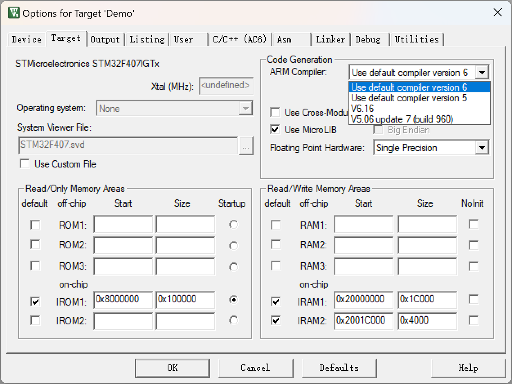
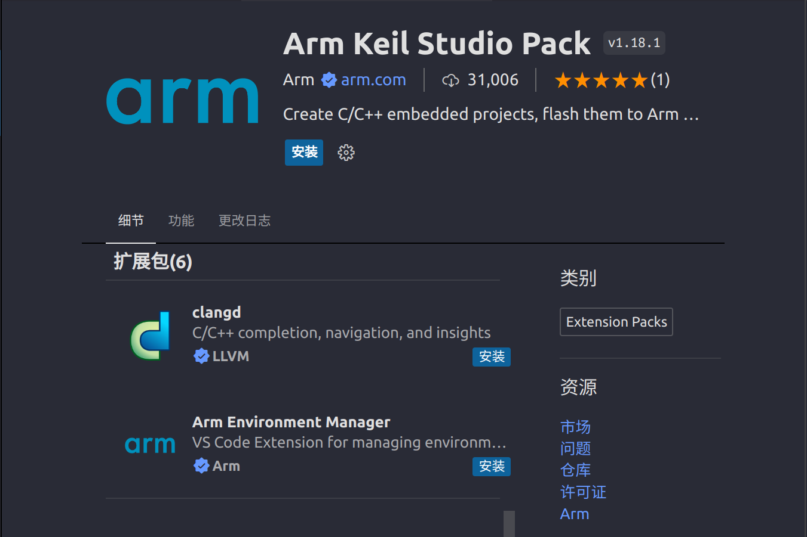
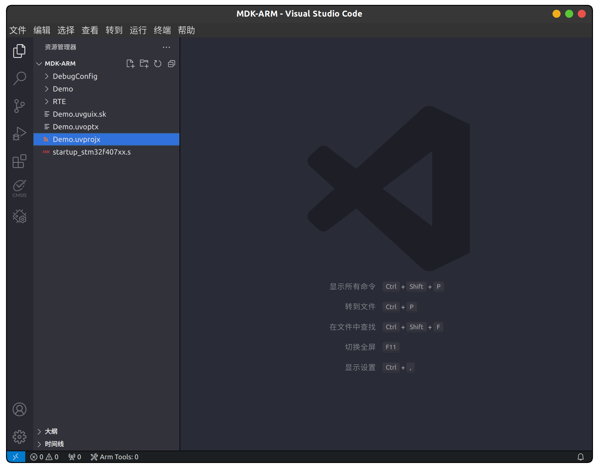
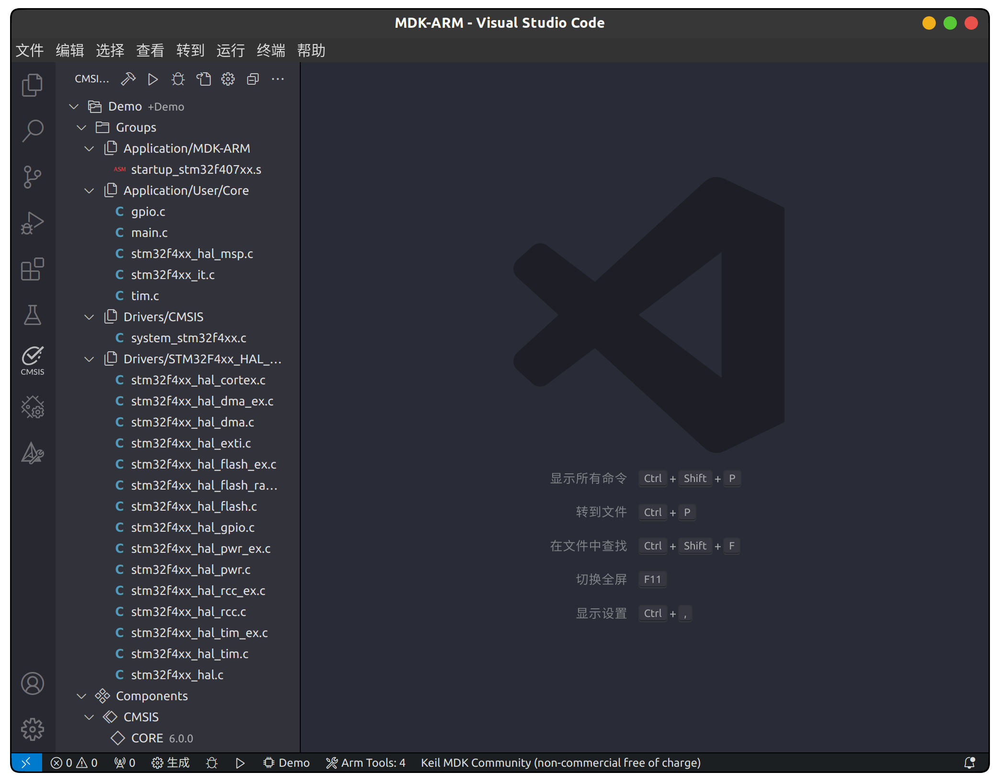
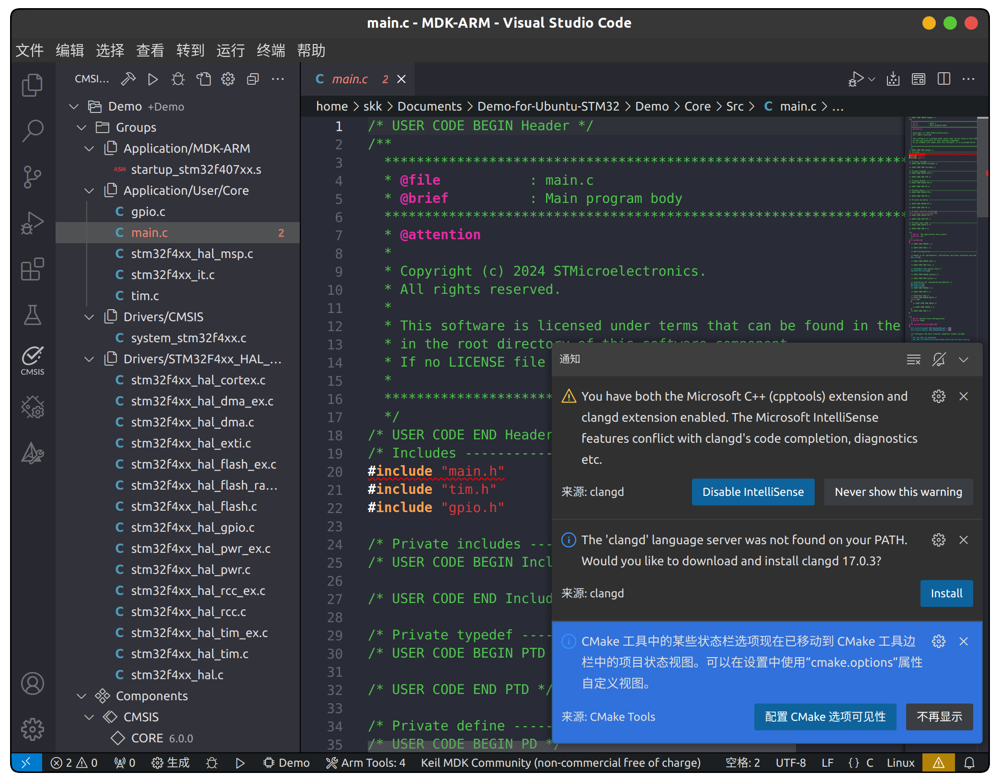
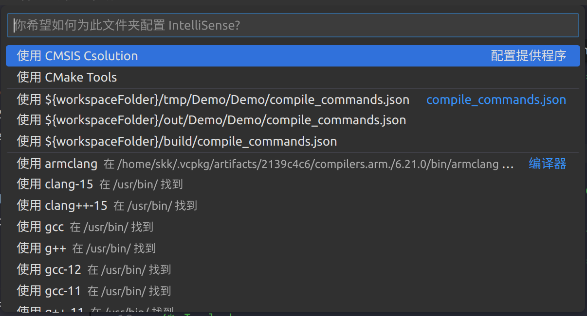
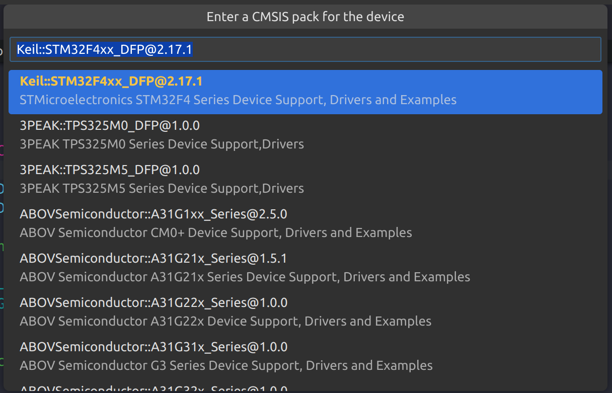

# VSCode配置MDK6教程
<del>**宇宙引战声明：VSCode就是世界上最好的IDE**</del>, 开发STM32怎么能少了VSCode这个优雅的平台呢, 正巧Keil又推出了新一代的MDK6. 但截止本文撰写之前, 网上仍然缺乏安装配置的中文资料, 因此本文旨在记录一下配置的详细过程, 与笔者踩过的坑.

## 系统环境
本文主要环境为
> Ubuntu 22.04 LTS / Windows 11 22H2
>
> ARM Keil Studio Pack V1.18.1


## 软件下载
1. [`STM32CubeMX`](https://www.st.com/zh/development-tools/stm32cubemx.html)
2. [`Keil5`](https://www.keil.com/download/product/)
3. [`arm-none-eabi`](https://developer.arm.com/downloads/-/arm-gnu-toolchain-downloads)
4. [`vcpkg`](https://github.com/microsoft/vcpkg)
5. [`CMake`](https://cmake.org/download/)(建议)
6. [`Clangd`](https://Clangd.llvm.org/)(可选)
7. [`pyOCD`](https://github.com/pyocd/pyOCD/tree/main)(仅Linux需要)

## 编译器配置(Windows)
在"软件下载"中提供的网址里下载最新版工具链即可, 截止本文撰写时, 下载的文件应该是`arm-gnu-toolchain-13.2.rel1-mingw-w64-i686-arm-none-eabi.zip`, 下载后将文件自行解压到一个地方, 并复制解压文件中`/bin`文件夹的绝对路径, 用于添加系统环境变量.

然后添加系统环境变量, 如果不会添加系统环境变量, 请自行百度. <del>这应该是基本技能吧</del>. 添加完成后, 在`cmd`中输入
``` shell
arm-none-eabi-gcc --version
```
如果有版本信息提示, 即为配置成功.

## 编译器配置(Ubuntu)
在"软件下载"中提供的网址里下载对应自己系统架构的工具链, 例如笔者的是`x86_64`架构, 下载后自行解压
``` shell
tar -xvf arm-gnu-toolchain-13.2.rel1-x86_64-arm-none-eabi.tar.xz
```
并将解压文件夹复制到`/usr`目录下(目录可以自选)
``` shell
sudo cp -ar ~/Downloads/arm-gnu-toolchain-13.2.rel1-x86_64-arm-none-eabi /usr
```
然后设置系统环境变量
``` shell
sudo vim ~/.bashrc
```
往文件最后添加工具链的`/bin`文件夹路径至环境变量中
``` shell
export PATH=$PATH:/usr/arm-gnu-toolchain-13.2.rel1-x86_64-arm-none-eabi/bin
```
保存并退出, 刷新一遍系统环境变量
``` shell
source ~/.bashrc
```
在终端中输入`arm-none-eabi-gcc --version`, 如果有版本信息提示, 即为配置成功.

## vcpkg配置
自行找一个文件目录, `git`克隆vcpkg仓库
``` shell
git clone https://github.com/microsoft/vcpkg.git
```
克隆完成后, 如果是Windows系统, 执行`bootstrap-vcpkg.bat`, 脚本会开始下载`vcpkg.exe`到脚本所在文件夹中, 当文件夹中出现`vcpkg.exe`时即为下载成功. 然后复制程序的路径, 添加到系统环境变量中.

如果是Ubuntu系统, 执行`bootstrap-vcpkg.sh`脚本
```shell
sudo sh bootstrap-vcpkg.sh
```
也会开始下载`vcpkg`文件, 下载完成后仿照上面的步骤将其添加进系统环境变量中.
```shell
export PATH=$PATH:/usr/vcpkg
```
添加完成后, 在终端中输入`vcpkg --version`, 如果有版本信息提示, 即为配置成功.

## CubeMX初始化工程
这一部分就是正常地用CubeMX按照自己的需求设置工程即可, 重点在于生成代码的设置

这里需要将工具链设置为MDK-ARM并设置版本号为`V5.32`. 然后即可生成代码

## 工程转换
MDK6不支持AC5(ARMClang 5)工程, 只支持AC6工程, 但是目前最新版的CubeMX还无法生成AC6工程, 只能利用Keil5进行转换.

Keil5只有Windows版本, 没有Linux版本, 因此工程转换对Ubuntu是无解的(也许可以用Wine?还没尝试过). 现在最好的办法应该是建一个转换好的Demo, 然后传GitHub上, 要用的时候克隆到本地. 再用CubeMX根据需要生成代码. 只要在Keil5转换过一次工程, 后面再用CubeMX调整代码是不需要再转换的. 接下来只演示Windows上的操作.


打开刚刚生成的工程, 在魔术棒里设置编译器为`Using default compiler 6`, 不要选择具体的某个版本, 如`V6.16`, `V6.21`等. 然后魔术棒中其他的选项可以按需自行设置, 比如这里还开启了`MicroLIB`, 设置编译标准为`C11`. 设置完成后, 先用Keil编译一遍工程, 如果成功, 当前工程就已经被转换为了AC6工程.

::: warning

当然也可以用Keil5将已有AC5转换为AC6, 但AC6编译器貌似有不少改动, 导致AC5工程有可能会编译不过, 需要自己调整代码, 让它符合AC6规范. 因此不建议转换比较大的旧AC5工程, 除非你非常乐意去改Error或者Warning.

:::
## VSCode配置
然后重点部分开始. VSCode扩展商店中搜索`Arm Keil Studio Pack`, 这是一个插件捆绑包, 里面除了Arm的开发组件, 还有`Clangd`. 它的配置过程会在下面介绍. 这个插件如果不需要, 也可以禁用掉, 直接用`C/C++`扩展的`Intellisense`功能也可.



安装完成后重启一下VSCode, 然后用VSCode打开刚刚转换完的工程里的`MDK-ARM`文件夹, 并右键`*.uvprojx`文件, 在弹出的菜单中选择`Convert uvision Project to Csolution`选项.



此时会弹出激活Arm环境, 直接选择`Always Allow`即可, 以后转换工程时就能自动激活Arm工程环境, 不需要重复设置.


然后VSCode下方的状态栏会自动开始安装Arm环境


安装完成后会提示`No Arm License`, 直接点击这个按钮, 在弹出的窗口中选第一个选项激活社区版License即可.


如果不出意料的话刚刚在激活Arm环境的过程中VSCode右下角会弹出一堆窗口, 接下来一个个解决.


这个是`YAML`插件收集信息并改进插件的提示, 直接`Accept`即可.


这是插件提示缺少MDK所需的一些Pack, 直接`Install`即可, 让它自动安装缺少的Pack. 如果安装完成, 插件会在VSCode右下方提示`xxx packs installed`, 安装速度取决于魔法速度.


这是CMake插件提示是否需要配置CMake(如果你的VSCode安装了CMake插件的话), 如果你想使用`Clangd`做代码提示, 那就需要CMake自动生成`compile_commands.json`, 这里必须点是. 否则这里可以选择"暂不处理".


接上面, 如果选择"是", 会弹出上图, 此时就不用管CMake了, 点击那个"浏览"选项也是没用的, 因为本来就没有生成`CMakeLists`, 找也是找不到的. 此时按下`Ctrl+Shift+P`输入`Reload`, 选择重启VSCode工作区.


重启后就会弹出自动生成`CMakeLists`的选项, 默认是生成在工作区目录下的`/tmp/${projectName}/${projectName}`文件夹下的. 然后会弹出选择编译工具链的界面, 选择刚刚配置的`arm-none-eabi`工具链即可. 如果找不到这个选项, 请检查工具链是否配置成功.


然后CMake插件就会自动生成`CMakeLists`, 在VSCode的终端里可以看到相关信息.

以上操作完成之后, 就可以开始写STM32的代码了, 切换到CMSIS插件, 工程文件的管理逻辑类似Keil, 在左侧可以看到各个Groups和Files, 很容易上手, 关键是比起Keil的界面(<del>无需多言</del>), 美观程度高了不少. 


## 继续设置VSCode
如果此前你的VSCode上已经安装了`C/C++`插件, 并且开启了`Intellisense`, 那`Intellisense`会与`Clangd`冲突(都是代码提示), 只能禁用掉其中之一. 如果要禁用掉前者, 直接在这里点击`Disable Intellisense`即可, 如果要禁用后者, 就去扩展管理中禁用掉`Clangd`插件. 两种代码提示方案都会在这里记录.



### 使用`Intellisense`
先记录一下如何配置`Intellisense`. 点击VSCode最下方的黄色感叹号按钮, 会弹出窗口让你选择编译命令的位置, 选择由"CMSIS Csolution"提供即可.


目前貌似只有选择这个选项才能让`Intellisense`正确进行代码检查, 理论上`compile_commands.json`应该也可以, 但实测会报一些类型未定义的错误, 但在报错的类型名上点跳转, 又能跳转到类型名的定义处. 目前还不知道怎么解决.

设置完之后就可以正常使用代码提示功能了, 包括代码跳转等等功能.

### 一些bug
使用`Intellisense`的时候有时候会有bug, 比如不会弹出上面这个选择窗口. 这个时候就需要自己设置使用`Csolution`, 否则它不知道这个工程是怎么构成的.

打开`.vscode`文件夹下的`settings.json`(没有就新建), 往里面添加一行
```YAML
"C_Cpp.default.configurationProvider": "cmsis-csolution"
```
然后重启VSCode窗口, `Intellisense`就可以从`Csolution`里获取编译命令并正确分析代码了.

有的时候还有另一种情况, 头文件报错, 比如会报`main.h`文件未找到, 这是因为没有正确设置`Intellisense`的头文件路径. 此时需要在`.vscode`下的`c_cpp_properties.json`文件中添加`IncludePath`
```YAML
"includePath": [
    "${workspaceFolder}/**",
    "../**"
]
```
这是将整个工程文件夹(应该是`MDK-ARM`文件夹的父文件夹)下的所有路径添加进`IncludePath`, 来寻找头文件. 如果前面已经正确设置了`configurationProvider`, 其实是不应该出现这个错误的. 但是如果你不想从`Csolution`获取编译命令, 那就需要自行添加`IncludePath`.

接上段, 有的时候即使正确配置了`IncludePath`, 还是会在很多地方莫名报错, 比如`main.c`文件里初始化系统时钟的`RCC_OscInitTypeDef`这种用于初始化的结构体类型, 它会报类型名未找到, 但是你去跳转类型定义时, 又能正确跳转. 这个bug无解, 或者应该说是我还没找到问题的来源. 但好消息是, 这个bug只有在不使用`Csolution`时会出现, 所以建议选择直接由`Csolution`提供编译命令, 而不是自己去配.

### 使用`Clangd`
代码量大的时候`Intellisense`会变得很卡, 相比之下`Clangd`的体验就好很多(<del>用过Jetbrains系都说好</del>), 而且`Clangd`还有`Clang-tidy`, `Clang-format`, 自动头文件补全等更加完善的功能. 为了更好的体验, 不妨继续折腾一下.

首先配置`Clangd`, 从[GitHub Release](https://github.com/Clangd/Clangd/releases/tag/17.0.3)上下载最新的`Clangd`并解压到一个位置, 添加`Clangd.exe`所在文件夹到系统环境变量. 在`cmd`中输入`Clangd --version`, 如果有版本信息提示即为配置成功. 如果是Ubuntu系统, 直接在终端中输入
```shell
sudo apt update && sudo apt install clangd-15
```
安装完成后输入
```shell
clangd-15 --version
```
确认安装是否成功.(Ubuntu官方的源最新版只到15, 可以去GitHub上下最新的版本并添加环境变量, 甚至可以自己去LLVM官网上找源码编译)

然后配置VSCode中的`Clangd`路径. 找到`Clangd`扩展设置中的`Clangd:Path`, 填入`clangd`即可(不需要指定`clangd`二进制文件的具体路径, 因为我们已经设置了环境变量, 插件会自动从系统环境变量里面找). 如果是Ubuntu, 填入`clangd-15`, 因为刚刚安装的包名叫`clangd-15`, 如果安装的是别的包, 自行改成对应的包名即可.


接着设置要传递给`Clangd`的参数.
``` YAML
"clangd.arguments": [
    "--all-scopes-completion",
    "--background-index",
    "--clang-tidy",
    "--header-insertion=iwyu",
    "--enable-config",
    "--completion-style=detailed",
    "--pch-storage=disk",
    "--compile-commands-dir=build",
    "--log=verbose",
    "-j=12",
]
```
关于每个参数具体的意思可以去查官方文档, 自行按需设置.

使用`Clangd`还要正确配置CMake, 上面已经有配置CMake的教程了, 如果安装了CMake插件却没有弹出配置`CMakeLists`的窗口, 或者之前没有配置, 只要重启VSCode并打开工程区, CMake插件就会自动检测到没有配置`CMakeLists`, 然后弹窗提示配置.

CMake自动配置完之后, 只要`/MDK-ARM/build/`文件夹下出现了`compile_commands.json`文件, `Clangd`就能正常工作了, 享受`Clangd`带来的舒适体验吧.

### 一些bug
这个bug仍然是悬而未决的, `Clangd`会莫名其妙的报类型名未找到, 但是在它报错的代码上点击定义跳转, 又能正确跳转到定义的位置. 这个问题非常玄学, 我调整了各种`CompileFlags`都解决不了, 最后只能选择屏蔽`unknown_typename`类型的错误. 如果有读者能够解决这个问题, 请麻烦告知笔者, 不胜感激.


顺便还可以多给出一点信息, 当`Intellisense`选择`compile_commands.json`作为`configurationProvider`时, 也会报`unknown_typename`的问题, 甚至报的更多, 连`uint32_t`都会报错. 很难不感觉是`compile_commands.json`的问题, 但是这是CMake自动生成的, 人为检查后笔者也不觉得有哪里缺少信息.

## 烧录与调试程序(Windows)
在Windows系统上非常简单, 只要插上调试器就能自动识别. 首次插入调试器时会在右下角弹窗提醒是否需要配置这个新调试器. 点击"是"即可. 然后会提示给调试器命名. 确认后需要选择固件包, 根据自己的型号选择即可.



等待插件自动配置完成后即可开始烧录或调试.第一次烧录或调试时会提示选择选择`task`, 选第一个即可(suggested). 


然后会提示安装ARM的调试工具, 点击"Install Arm Debugger"安装即可. 安装速度取决于魔法速度.


安装完成后再次开始烧录或调试, 即可正常进行, 可以在输出台中观察到烧录进度.
各种单步断点调试, 变量观察, 寄存器观察功能支持的都非常完善. 而且这里是可以观察内核寄存器的, 应该是ARM的独家功能, 像之前ST的插件就只能看外设寄存器, 而且调试功能支持的也没那么完善.

## 烧录与调试程序(Ubuntu)
在Ubuntu上的操作麻烦一些, 首先要下载`pyOCD`. 自行找一个目录, 执行以下命令
```shell
git clone https://github.com/pyocd/pyOCD.git
cd pyOCD
pip3 install .
```
如果你没有安装`python3-pip`, 请先安装
```shell
sudo apt install python3-pip
```
安装完成后, 在仓库目录下输入以下指令
``` shell
cd udev
sudo cp *.rules /etc/udev/rules.d
# restart udev to apply changes immediately
sudo udevadm control --reload
sudo udevadm trigger
```
然后重新连接调试器, VSCode应该就会提示检测到你的调试器了. 后面的配置过程就与Windows下一样了.

如果你的调试器不是官方调试器, 而是兼容那些协议的调试器, 比如笔者手上的是野火的调试器, 兼容`CMSIS-DAP`协议, 那么上面的`.rules`文件里很可能不包含你的设备信息, 即使你进行了上面的操作, VSCode仍然不能检测到你的调试器. 这时需要自己添加进配置文件. 先在终端输入
```shell
sudo dmesg
```
然后在显示出的一大堆设备列表里找到类似这样的信息
```plain
[  968.411904] usb 3-1: New USB device found, idVendor=c251, idProduct=f001, bcdDevice= 1.00
[  968.411911] usb 3-1: New USB device strings: Mfr=1, Product=2, SerialNumber=3
[  968.411914] usb 3-1: Product: Fire CMSIS-DAP
[  968.411917] usb 3-1: Manufacturer: KeilSoftware
[  968.411919] usb 3-1: SerialNumber: FS-00000000
```
然后打开对应协议的`.rules`文件, 比如笔者的调试器是`CMSIS-DAP`协议, 就打开`50-cmsis-dap.rules`. 如果你不知道协议对应的文件名, 用`ls`指令查看即可. 
```shell
sudo vim /etc/udev/rules.d/50-cmsis-dap.rules
```
然后仿照上面已有信息的格式, 添加一行
``` conf
SUBSYSTEM=="usb", ATTR{idVendor}=="c251", ATTR{idProduct}=="f001", MODE:="666"
```
这里的`idVendor`和`idProduct`是你从`dmesg`中查看到的信息, 改为自己对应的信息即可. 然后保存并重启`udev`使配置立刻生效. 这时重新插入调试器, VSCode应该就能检测到你的调试器了, 后面的配置过程和Windows系统下就一样了.

关于配置调试器的具体信息, 可以在[官方文档](https://github.com/pyocd/pyOCD/blob/main/udev/README.md)中详细了解. 在Linux上需要把USB调试器设备信息自己添加进`udev`的原因是, Linux默认情况下不允许普通用户访问USB调试器(只有`sudo`可以), 因此我们需要开放权限, 允许普通用户访问调试器, 才能让ARM调试插件正常调用`pyOCD`进行调试. 关于这一段, 可以自行搜索Linux对USB设备访问权限的管理策略进一步详细了解.

## 添加已有文件到工程中
如果要添加已有的文件, 需要修改`Csolution`的配置文件. 在VSCode的资源管理器中找到后缀为`.cproject.yml`的文件.


在这后面按照`YAML`格式添加`IncludePath`即可.


在这后面按照`YAML`格式添加文件分组和文件列表即可, 如果是Keil的用户, 对这个文件管理逻辑应该非常熟悉.

添加完源文件和头文件之后, 记得在CMake选项卡中重新生成一次`CMakeLists`, 才能更新编译命令, 让`Clangd`正常分析代码.

## 最后
如果还有配置上的问题, 可以自己去读官方`doc`, 这里贴几个官方`doc`

[`Arm Keil Studio Visual Studio Code Extensions User Guide`](https://developer.arm.com/documentation/108029/0000/?lang=en)

[`CMSIS-Toolbox`](https://github.com/Open-CMSIS-Pack/cmsis-toolbox/tree/main/docs)

[`pyOCD`](https://pyocd.io/docs/)

[`pyOCD udev rules`](https://github.com/pyocd/pyOCD/blob/main/udev/README.md)

[`Clangd`](https://clangd.llvm.org)

建议多去`Google`上搜搜问题, 不得不说中文社区确实缺乏这方面的高质量信息, 多去`StackOverFlow`, `Reddit`, `AskUbuntu`这些网站上搜搜, 能获益不少.

## 修改记录
::: info 本章修改记录
2024/3 完成编写 (邵恺)

2024/3 网页适配 (邵恺)
:::